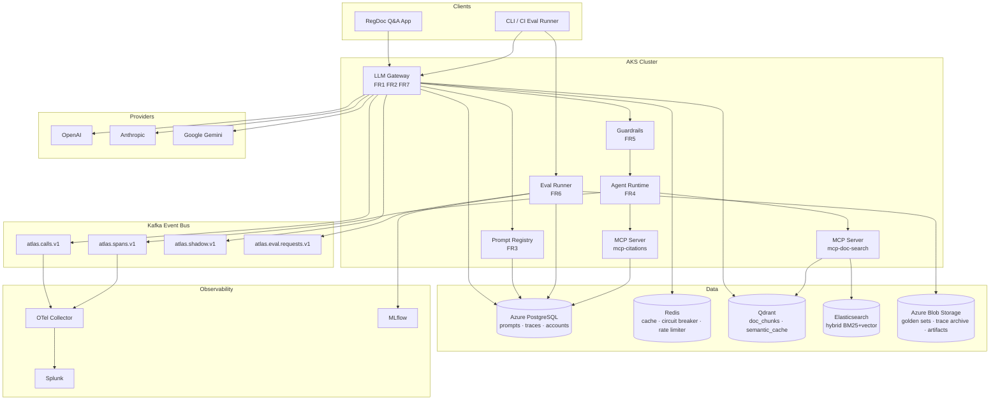
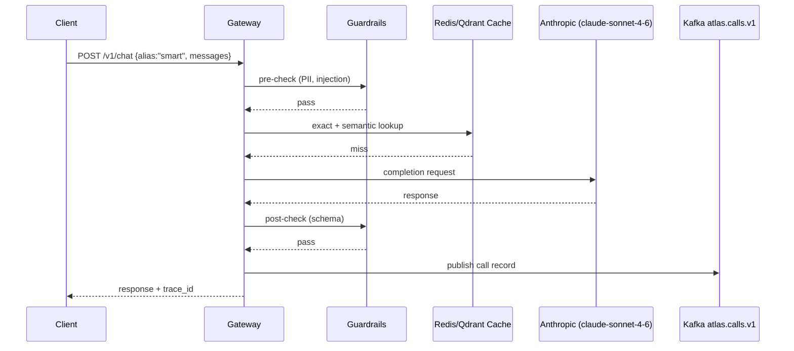
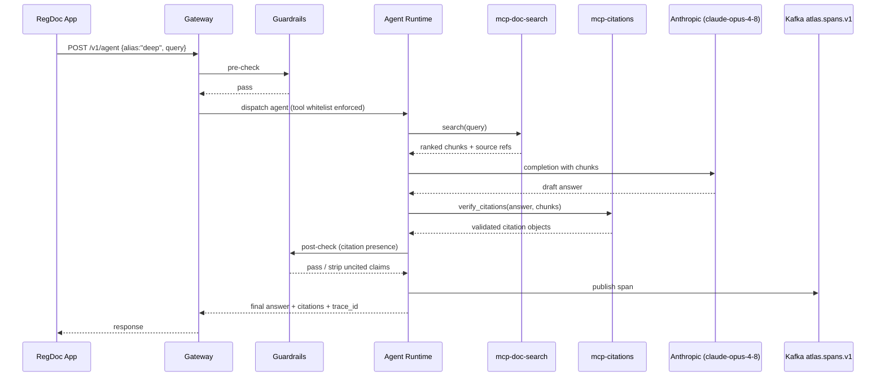

# Atlas — Overview, Goals & Requirements

## Vision

Atlas is an internal AI platform that acts as the single, authoritative gateway through which every LLM call in the organisation must flow. No application talks to a model provider directly: every completion, agent run, and embedding request passes through Atlas, which enforces guardrails, records a full trace, accounts for cost, and applies the correct versioned prompt — all before the response reaches the caller. The demo workload is a regulatory-document Q&A agent that must answer with enforced citations, making it a concrete stress-test for every platform guarantee: hallucination prevention, token budget enforcement, tool-call tracing, and eval-gated prompt promotion.

---

## Why This Stack

Atlas deliberately mirrors Enhesa's confirmed production stack. The technology choices are not academic; they reflect what a senior AI Platform Lead joining Enhesa would inherit and extend:

- **Azure / AKS** — Enhesa runs on Azure; Atlas provisions all infrastructure there, including AKS for container orchestration, ACR for image registry, Azure Database for PostgreSQL Flexible Server, Azure Blob Storage, and Azure Key Vault with the Secrets Store CSI driver.
- **Qdrant** — vector store for document chunks and semantic cache, matching Enhesa's retrieval layer.
- **Elasticsearch** — hybrid BM25 + vector search, consistent with Enhesa's search infrastructure.
- **Kafka** — event bus for call records, spans, shadow evals, and eval requests; mirrors the event-driven patterns used in Enhesa's data platform.
- **Splunk** — observability target via OTel Collector with GenAI semantic conventions, Enhesa's existing log/trace aggregation choice.
- **MLflow** — experiment and eval tracking, consistent with Enhesa's ML tooling.
- **Bitbucket Pipelines** — CI/CD, matching Enhesa's SCM platform.
- **Multi-provider (OpenAI + Anthropic + Google)** — Enhesa works across providers; Atlas abstracts them behind a Provider Protocol so aliases, fallbacks, and cost comparisons work uniformly.
- **Python AI microservices** — FastAPI + asyncio + pydantic v2, consistent with Enhesa's Python-first AI services.

Every architectural decision in Atlas has a direct counterpart in the Enhesa platform, making it a production-representative portfolio project rather than a toy demo.

---

## Goals

- Provide one platform layer for all LLM traffic — no provider SDK is called outside the gateway.
- Version, evaluate, and promote prompts and models through a controlled gate, the same way source code is released.
- Run agents under declared, enforced constraints: token/cost budgets, tool whitelists, and timeouts.
- Make every response fully traceable: request → prompt version → model → tool calls → cost → citations.
- Build incrementally; each phase (P0–P5) is independently demoable without requiring later phases to be complete.

## Non-Goals

- Model training or fine-tuning (integration only; Atlas calls hosted endpoints).
- Multi-region high availability or geo-redundant failover.
- Fine-grained multi-tenancy (single-org deployment).
- UI polish or a polished end-user product — correctness and observability take priority.

---

## Functional Requirements

| ID  | Requirement |
|-----|-------------|
| FR1 | Route chat and completion requests across ≥ 2 providers using stable model aliases (e.g. `smart`, `deep`, `fast`); resolve aliases to concrete model IDs at dispatch time. |
| FR2 | Provider failover with retry and exponential backoff (tenacity); Redis-backed per-provider circuit breaker; semantic cache (Qdrant) and exact cache (Redis) to avoid redundant provider calls. |
| FR3 | Prompt CRUD with full version history; promotion requires passing an eval gate; instant rollback to any prior version without redeployment. |
| FR4 | Agent execution with declared tool whitelists enforced via MCP; every tool call captured in a full distributed trace. |
| FR5 | Pre-response guardrails: PII redaction, prompt-injection screening. Post-response guardrails: output schema validation, citation presence and format check. |
| FR6 | Eval suites runnable against golden datasets; integrated into CI; promotion blocked on regression relative to the current production prompt version. |
| FR7 | Per-key and per-application accounting of token usage, estimated cost, and latency; queryable via internal API. |

---

## Non-Functional Requirements

| ID   | Requirement |
|------|-------------|
| NFR1 | Gateway overhead < 50 ms p95, excluding provider round-trip time. |
| NFR2 | Zero secrets in source code or container images; all credentials sourced from Azure Key Vault via the Secrets Store CSI driver. |
| NFR3 | All infrastructure reproducible from Terraform IaC; a single command brings up a fully functional environment. |
| NFR4 | 100 % of agent runs produce an OTel-compliant distributed trace exported to the OTel Collector. |
| NFR5 | Hard token/cost budget caps enforced per API key; alert triggered at 80 % of cap; requests exceeding the cap are rejected with a structured error. |

---

## High-Level Architecture

---

## Request-Flow Narratives

### (a) Simple Chat Completion

A caller sends a chat request using the alias `smart`. The gateway resolves the alias to `claude-sonnet-4-6` (primary) with `gpt-4.1` as fallback. Pre-guardrails screen for PII and prompt injection. The gateway checks the exact cache (Redis); on a miss it checks the semantic cache (Qdrant). On a full cache miss the request is forwarded to the Anthropic API. The response passes post-guardrails (schema validation). The call record is written to `atlas.calls.v1` and the token/cost delta is applied to the caller's account in PostgreSQL.

### (b) Agent RAG Run with Citation Enforcement

A regulatory Q&A query arrives. The agent runtime is invoked; it declares tool whitelist `[doc-search, citations]` via MCP. The agent calls `mcp-doc-search`, which queries Qdrant (vector) and Elasticsearch (BM25) to retrieve ranked document chunks. The agent synthesises an answer and calls `mcp-citations` to attach verified citation objects. Post-guardrails validate that every factual claim maps to a citation; uncited claims are stripped and the response is flagged. A full distributed trace is emitted to `atlas.spans.v1`. The eval runner can replay the trace against a golden dataset to measure citation recall.

---

## Demo Workload

**Regulatory-Document Q&A Agent** — a RAG agent that answers questions over a corpus of regulatory documents (e.g. REACH, RoHS, conflict-minerals filings). Users need answers they can trust enough to act on; that requires every factual claim to be traceable to a specific passage in a specific document version.

Citation-enforced answers are the hardest trust problem in RAG because:

1. **Hallucination is silent** — the model produces fluent, confident text whether or not supporting evidence exists in the retrieved chunks.
2. **Retrieval quality is uneven** — BM25 and vector search both miss relevant passages; a good guardrail must detect when the answer claims more than the retrieved context supports.
3. **Regulatory stakes are high** — an uncited or incorrectly cited compliance answer can cause real business harm; there is no tolerance for graceful degradation.

The demo therefore exercises every Atlas capability: the gateway (routing, cost), the prompt registry (versioned extraction prompt), the eval gate (citation recall vs golden Q&A pairs), the agent runtime (multi-turn tool calls), MCP servers (doc-search, citations), guardrails (citation presence check), and observability (full trace for audit).

---

## Glossary

| Term | Definition |
|------|------------|
| **Gateway** | The central FastAPI service through which all LLM traffic is routed. Handles auth, caching, failover, accounting, and guardrails dispatch. |
| **Prompt Registry** | A versioned store (PostgreSQL) of prompt templates. Prompts are promoted through an eval gate and can be rolled back instantly. |
| **Eval Gate** | A required evaluation pass before a prompt version (or model alias mapping) is promoted to production. Run as a CI step against golden datasets; blocks promotion on regression. |
| **Guardrail** | A synchronous check applied before (pre) or after (post) the model call. Pre-guardrails handle PII redaction and injection screening; post-guardrails handle schema validation and citation enforcement. |
| **MCP** | Model Context Protocol — the official standard for declaring and exposing tools to an agent. Atlas runs `mcp-doc-search` and `mcp-citations` as in-cluster MCP servers; the agent runtime enforces a declared tool whitelist per run. |
| **Model Alias** | A stable, provider-agnostic name (e.g. `smart`, `deep`, `fast`) that maps to a concrete model ID (e.g. `claude-sonnet-4-6`) with a declared fallback. Aliases insulate callers from provider churn. |
| **Citation Enforcement** | A post-response guardrail that validates every factual claim in an agent answer against the retrieved source chunks. Uncited claims are stripped; the trace records which claims were removed. |
| **Semantic Cache** | A Qdrant-backed cache that stores embeddings of prior requests. A new request within a configurable cosine-similarity threshold is served from cache without calling a provider. |
| **Shadow Eval / Drift** | A pattern where live traffic is asynchronously replayed against a candidate prompt version (published to `atlas.shadow.v1`) and evaluated in parallel, without affecting the production response. Detects quality drift before a formal promotion. |
