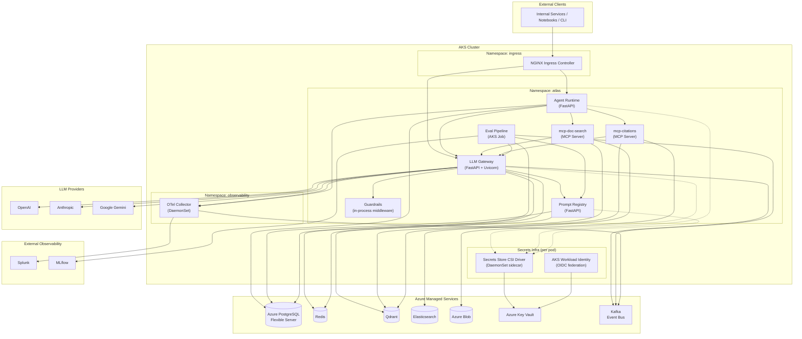
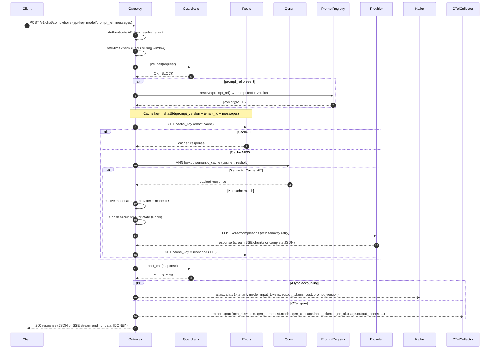
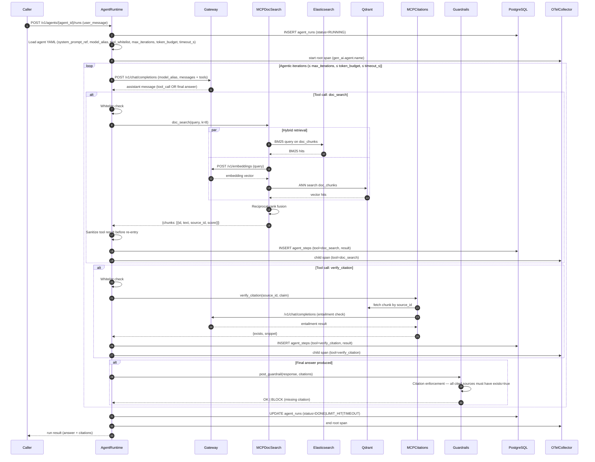

# Atlas — System Architecture

> **Scope:** This document is the authoritative system-architecture reference for Atlas, Enhesa's internal AI platform. All LLM traffic is routed through a central gateway; no service calls a model provider directly.

---

## Table of Contents

1. [Component Catalogue](#1-component-catalogue)
2. [C4-Style Container Diagram](#2-c4-style-container-diagram)
3. [Sequence: Chat Request](#3-sequence-chat-request)
4. [Sequence: Agent Run](#4-sequence-agent-run)
5. [Data-Flow Summary](#5-data-flow-summary)
6. [Control Plane vs Data Plane](#6-control-plane-vs-data-plane)
7. [Cross-Cutting Concerns](#7-cross-cutting-concerns)

---

## 1. Component Catalogue

### 1.1 LLM Gateway

**Responsibility**
Single ingress for all model calls. Exposes an OpenAI-compatible REST surface (`POST /v1/chat/completions`, `GET /v1/models`, `POST /v1/embeddings`) so internal clients require no provider-specific SDKs. Handles authentication, rate limiting, budget enforcement, semantic caching, provider routing, retry, and circuit breaking.

#### Key interfaces / dependencies

| Direction | Dependency | Notes |
|-----------|-----------|-------|
| Inbound | Clients (services, Agent Runtime, notebooks) | Per-key auth header; model alias or `prompt_ref` |
| Outbound | Provider Protocol → OpenAI, Anthropic, Google Gemini, MockProvider | Uniform async interface; tenacity retries |
| Outbound | Redis | Semantic cache (exact + approximate), circuit-breaker counters, rate-limit windows |
| Outbound | Qdrant `semantic_cache` collection | Vector similarity cache |
| Outbound | Prompt Registry | Resolve `prompt_ref` → versioned prompt text + metadata |
| Outbound | Guardrails middleware | Pre- and post-call filter chain |
| Async | Kafka `atlas.calls.v1` | Per-call accounting event |
| Telemetry | OTel SDK | Span per call; `gen_ai.*` semconv attributes |

**How it scales**
Stateless FastAPI + Uvicorn workers behind AKS HPA (CPU + RPS metrics). Redis holds all shared state (cache, rate-limit counters, circuit-breaker state), allowing any pod to serve any request.

#### Primary failure modes

- Provider outage → circuit breaker opens; 503 returned; event still emitted to Kafka for accounting consistency
- Redis unavailable → cache miss path; rate-limit enforcement degrades to best-effort; circuit breaker falls back to closed
- Budget exhaustion → 429 with `X-Budget-Exhausted` header; 80 % threshold triggers alert before hard stop

---

### 1.2 Prompt Registry

**Responsibility**
Versioned store for all prompt templates and system-prompt references. Enforces the rule that clients never embed prompt text in requests. Provides a content-addressed lookup by `prompt_ref` (name + semver), diff/audit trail, and promotion workflow (draft → reviewed → production).

#### Key interfaces / dependencies

| Direction | Dependency | Notes |
|-----------|-----------|-------|
| Inbound | Gateway (sync read) | Resolve `prompt_ref` on every non-cached call |
| Inbound | Eval pipeline (read) | Fetch prompt versions for golden-set runs |
| Storage | Azure PostgreSQL | Prompt rows with version, hash, tenant scope |
| Cache | Redis | Short-lived TTL per `prompt_ref` to avoid DB round-trips on hot paths |

**How it scales**
Read-heavy; Redis caching absorbs >95 % of load. PostgreSQL Flexible Server with read replica for eval pipeline batch reads.

#### Primary failure modes

- Registry miss (unknown `prompt_ref`) → gateway returns 400 immediately; never falls back to client-supplied text
- Redis cache stale after promotion → explicit invalidation on write; TTL acts as backstop

---

### 1.3 Guardrails

**Responsibility**
Ordered middleware chain applied before and after every LLM call. Pre-call guards: PII detection, topic/content policy, prompt-injection screening. Post-call guards: output content policy, citation enforcement (agent path), structured-output schema validation.

#### Key interfaces / dependencies

| Direction | Dependency | Notes |
|-----------|-----------|-------|
| Inbound | Gateway (sync, inline) | Receives request/response envelope |
| Outbound | Redis | Per-tenant policy config cache |
| Outbound | PostgreSQL | Policy definitions, audit log writes |
| Telemetry | OTel | `guardrail.decision` span event |

**How it scales**
Stateless Python functions; runs in-process within gateway pods. Policy config cached in Redis; no additional replicas needed.

#### Primary failure modes

- Guardrail timeout → fail-closed (block request); logged as `guardrail.timeout` span event
- Policy config cache miss → falls back to DB; adds latency spike

---

### 1.4 Agent Runtime

**Responsibility**
Hand-rolled thin agentic loop. Loads an agent definition from YAML (fields: `system_prompt_ref`, `model_alias`, `tool_whitelist[]`, `max_iterations`, `token_budget`, `timeout_s`), then iterates: gateway call → tool dispatch → result re-entry, until a final answer is produced or a hard cap is hit. Persists every run and step to PostgreSQL. Emits a multi-span OTel trace with one child span per iteration.

#### Key interfaces / dependencies

| Direction | Dependency | Notes |
|-----------|-----------|-------|
| Inbound | API callers | Run request: agent ID + user message |
| Outbound | Gateway (`/v1/chat/completions`) | All LLM calls go through gateway |
| Outbound | MCP servers (doc-search, citations) | Via MCP official Python SDK |
| Storage | PostgreSQL `agent_runs`, `agent_steps` | Full persistence |
| Telemetry | OTel | `gen_ai.agent.name` span attribute; child spans per step |

**How it scales**
Each agent run is an independent async coroutine; runtime pods scale horizontally. Long-running runs stay pinned to one pod for the duration (no mid-run migration needed); AKS pod disruption budget prevents eviction during active runs.

#### Primary failure modes

- `max_iterations` or `token_budget` exceeded → run terminates with `LIMIT_HIT` status; partial steps persisted
- MCP tool timeout → tool result marked `ERROR`; loop can continue or abort depending on agent config
- Gateway 503 → tenacity retries within `timeout_s`; if exceeded, run status = `TIMEOUT`

---

### 1.5 MCP Server: mcp-doc-search

**Responsibility**
Exposes one tool: `doc_search(query, k=8) → {chunks: [{id, text, source_id, score}]}`. Implements hybrid retrieval: BM25 lexical search via Elasticsearch (`doc_chunks` index) merged with dense vector search via Qdrant (`doc_chunks` collection). Reciprocal-rank fusion combines the two result lists before returning the top-k chunks.

#### Key interfaces / dependencies

| Direction | Dependency | Notes |
|-----------|-----------|-------|
| Inbound | Agent Runtime (MCP SDK) | Tool call over stdio/HTTP transport |
| Outbound | Elasticsearch | BM25 keyword search on `doc_chunks` index |
| Outbound | Qdrant | ANN vector search on `doc_chunks` collection |
| Outbound | Gateway `/v1/embeddings` | Embed query before vector search |

**How it scales**
Stateless; scale Elasticsearch data nodes and Qdrant replicas independently. Query embedding cached in Redis to avoid redundant gateway calls for repeated queries.

#### Primary failure modes

- ES timeout → fall back to vector-only results; logged
- Qdrant timeout → fall back to BM25-only results; logged
- Both unavailable → tool returns empty chunk list; agent must handle gracefully

---

### 1.6 MCP Server: mcp-citations

**Responsibility**
Exposes one tool: `verify_citation(source_id, claim) → {exists: bool, snippet: str}`. Confirms that a claimed statement is substantiated by the referenced source document. Used by the post-guardrail citation enforcement step in the agent loop.

#### Key interfaces / dependencies

| Direction | Dependency | Notes |
|-----------|-----------|-------|
| Inbound | Agent Runtime (MCP SDK) | Tool call |
| Outbound | Elasticsearch `doc_chunks` index | Primary lookup: fetch chunk by `source_id` (fast path) |
| Outbound | Qdrant `doc_chunks` collection | Fallback lookup if ES returns nothing |

**How it scales**
Stateless; scales with agent runtime. ES and Qdrant lookups by ID are O(1).

#### Primary failure modes

- Chunk not found → `exists: false`; agent cites incorrectly; post-guardrail blocks response
- Entailment model call fails → conservative `exists: false`; fail-closed

---

### 1.7 Eval Pipeline

**Responsibility**
Offline and gate-time evaluation of prompt versions and model changes. Runner replays golden sets against the gateway, scores outputs (ROUGE, semantic similarity, citation recall), logs results to MLflow, and gates promotions. Triggered by CI on every prompt-version change and by scheduled nightly runs.

#### Key interfaces / dependencies

| Direction | Dependency | Notes |
|-----------|-----------|-------|
| Inbound | Bitbucket Pipelines (CI trigger) | Promotion gate |
| Inbound | Kafka `atlas.eval.requests.v1` | Async eval request from shadow traffic |
| Outbound | Gateway | Replay calls |
| Outbound | Prompt Registry | Fetch prompt version under test |
| Storage | MLflow | Experiment tracking, metric storage, artifact registry |
| Storage | PostgreSQL | Golden-set definitions, eval run metadata |

**How it scales**
Batch workload; runs as AKS Job. Parallelism controlled by Kubernetes `completions`/`parallelism` fields.

#### Primary failure modes

- Gateway rate-limit hit during replay → eval runner respects 429 back-off
- MLflow unreachable → eval fails; pipeline blocks promotion

---

### 1.8 Kafka Event Bus

**Responsibility**
Durable async backbone for accounting, tracing spans, shadow traffic, and eval request dispatch. Decouples the gateway hot path from downstream consumers.

#### Topics

| Topic | Producer | Consumers |
|-------|----------|-----------|
| `atlas.calls.v1` | Gateway (post-call) | Cost accounting service, billing dashboards |
| `atlas.spans.v1` | OTel Collector | Splunk (log search), analytics |
| `atlas.shadow.v1` | Gateway (shadow mode) | Eval pipeline shadow runner |
| `atlas.eval.requests.v1` | Eval scheduler / CI | Eval pipeline runner |

**How it scales**
Partition count per topic tuned to peak TPS. Consumer groups allow independent scaling of accounting and eval consumers.

#### Primary failure modes

- Broker unavailable → gateway continues to serve; accounting events buffered in-process (bounded queue) or dropped after threshold; at-least-once delivery resumes on reconnect
- Consumer lag → ops alert at configurable threshold; backpressure via consumer pause or parallel scaling

---

### 1.9 Observability: OTel → Collector → Splunk

**Responsibility**
Distributed tracing and log aggregation across all services. Each service instruments with the OTel Python SDK; the Collector (deployed as a DaemonSet sidecar) batches and exports to Splunk.

#### Span attributes (GenAI semconv)

`gen_ai.system` · `gen_ai.request.model` · `gen_ai.response.model` · `gen_ai.usage.input_tokens` · `gen_ai.usage.output_tokens` · `gen_ai.operation.name` · `gen_ai.agent.name`

#### Key interfaces / dependencies

| Direction | Dependency |
|-----------|-----------|
| Inbound | OTel SDK in all pods → OTel Collector (OTLP gRPC) |
| Outbound | Collector → Splunk HEC |
| Outbound | Collector → Kafka `atlas.spans.v1` (parallel export) |

**How it scales**
DaemonSet Collector ensures one collector per node; Splunk indexer cluster scales independently.

#### Primary failure modes

- Collector crash → spans buffered in SDK memory; data loss after buffer exhaust
- Splunk HEC unavailable → Collector retries with exponential back-off; disk buffer as secondary

---

### 1.10 MLflow

**Responsibility**
Experiment tracking and model/prompt artifact registry for the eval pipeline. Stores metrics, parameters, and scored artifacts for each eval run. Promotion decisions reference MLflow run IDs.

**How it scales**
Single deployment with PostgreSQL backend store and Azure Blob artifact store. Scales vertically; not on the request hot path.

**Primary failure modes**
Unavailability blocks eval pipeline and CI gates; does not affect runtime serving.

---

### 1.11 Data Stores

#### Azure Database for PostgreSQL (Flexible Server)

**Responsibility:** System-of-record for prompt registry, agent run/step history, golden sets, eval metadata, policy definitions, and audit logs. Hot path uses asyncpg directly; background/admin uses SQLAlchemy 2.0 async + Alembic migrations.

**Failure mode:** Primary failover handled by Azure Flexible Server HA (standby replica, ~30s RTO). Gateway falls back to cached prompts during brief outages.

#### Redis

**Responsibility:** Exact semantic cache (key = prompt-version + tenant + hash of messages), rate-limit sliding windows, monthly budget counters, circuit-breaker state, policy config cache, short-lived prompt-ref cache.

**Failure mode:** Cache miss; rate-limit degrades to best-effort; circuit breakers fall back to closed. No durable state stored here.

#### Qdrant

**Responsibility:** Dense vector search for two collections: `doc_chunks` (retrieval for doc-search MCP) and `semantic_cache` (ANN cache for gateway). Embeddings produced by gateway `/v1/embeddings`.

**Failure mode:** `doc_chunks` — fall back to BM25 only. `semantic_cache` — cache miss; extra provider call.

#### Elasticsearch

**Responsibility:** Hybrid retrieval partner (BM25 on `doc_chunks` index) for mcp-doc-search. Secondary index for log/span search (ingested from Kafka `atlas.spans.v1` via Logstash/Kafka consumer).

**Failure mode:** BM25 leg of hybrid search degrades to vector-only.

#### Azure Blob

**Responsibility:** Raw document storage (PDFs, HTML, regulatory docs) and MLflow artifact store. mcp-citations fetches full documents when chunk context is insufficient. Eval pipeline reads/writes scored artifacts.

**Failure mode:** Citation verification falls back to chunk-only; MLflow artifact writes fail (blocks eval).

---

## 2. C4-Style Container Diagram



---

## 3. Sequence: Chat Request



---

## 4. Sequence: Agent Run



---

## 5. Data-Flow Summary

### Kafka

| Topic | Writer | Readers | Purpose |
|-------|--------|---------|---------|
| `atlas.calls.v1` | Gateway (post-call, async) | Cost accounting service, billing dashboard | Per-call accounting events; includes tenant, model, token counts, cost, prompt version |
| `atlas.spans.v1` | OTel Collector (parallel export) | Elasticsearch Logstash consumer, Splunk | Span/log shipping for search and alerting |
| `atlas.shadow.v1` | Gateway (shadow-mode requests) | Eval pipeline shadow runner | Captures live traffic for offline evaluation without affecting production latency |
| `atlas.eval.requests.v1` | Eval scheduler / Bitbucket CI | Eval pipeline runner | Triggers targeted evaluation runs against specific prompt versions or model aliases |

### Qdrant

| Collection | Writer | Reader | Purpose |
|------------|--------|--------|---------|
| `doc_chunks` | Document ingestion pipeline (offline) | mcp-doc-search (ANN), mcp-citations (ID lookup) | Dense vector index of regulatory document chunks |
| `semantic_cache` | Gateway (on cache write) | Gateway (on cache lookup) | ANN-based approximate semantic cache; reduces redundant provider calls |

### Elasticsearch

| Index | Writer | Reader | Purpose |
|-------|--------|--------|---------|
| `doc_chunks` | Document ingestion pipeline (offline) | mcp-doc-search (BM25) | Inverted index for keyword/BM25 retrieval in hybrid search |
| `atlas-spans-*` (daily rollover) | Logstash consuming `atlas.spans.v1` | Ops / Splunk dashboards | Span and log search; alerting on error rates, latency |

### MLflow

| What | Writer | Reader |
|------|--------|--------|
| Eval metrics (ROUGE, semantic-sim, citation-recall), params, run metadata | Eval pipeline | Prompt Registry promotion workflow, engineers |
| Prompt artifact versions | Eval pipeline | Engineers, audit |

### Splunk

Receives all spans and structured logs exported by the OTel Collector via HEC. Used for dashboards on token usage, cost, latency (p50/p95/p99), error rates, guardrail decisions, and circuit-breaker events.

---

## 6. Control Plane vs Data Plane

```
┌─────────────────────────────────────────────────────────────────┐
│                        CONTROL PLANE                            │
│                                                                 │
│  Prompt Registry   Eval Pipeline   MLflow   Policy Config       │
│  (CRUD, versioning, (golden sets,  (metrics, (guardrail rules,  │
│   promotion gates)  CI gate)        artifacts) tenant settings) │
│                                                                 │
│  Latency budget: none — these paths are asynchronous or         │
│  invoked during CI, not in the live request path.               │
└──────────────────────────────┬──────────────────────────────────┘
                               │ config reads (cached)
                               ▼
┌─────────────────────────────────────────────────────────────────┐
│                         DATA PLANE                              │
│                                                                 │
│  Gateway request path                                           │
│    auth → rate-limit → pre-guardrail → cache lookup             │
│    → prompt resolve (Redis) → provider call → post-guardrail    │
│    → async Kafka emit + OTel span                               │
│                                                                 │
│  Agent Runtime loop                                             │
│    Gateway call → MCP tool dispatch → result sanitize → re-entry│
│                                                                 │
│  ★ p95 latency budget: <50 ms overhead (exclusive of provider   │
│    and MCP round-trips). This covers: auth, rate-limit check,   │
│    Redis cache lookup, prompt resolution, guardrails, Kafka     │
│    publish (async, non-blocking), OTel span export.             │
└─────────────────────────────────────────────────────────────────┘
```

**Where the <50 ms p95 budget applies:** Every synchronous step on the gateway hot path before and after the provider call. Provider RTT and MCP tool RTT are excluded — they are tracked separately and surface in the `gen_ai.usage.*` span attributes. The budget is enforced via Splunk alerting on the `gateway.overhead_ms` custom span attribute.

---

## 7. Cross-Cutting Concerns

### 7.1 Multi-Tenancy Boundaries

- **Auth:** Every request carries a per-key API token scoped to a `tenant_id`. The gateway validates and attaches `tenant_id` to the request context before any processing.
- **Rate limits and budgets:** Windows are keyed by `(tenant_id, key_id)`. A tenant's budget exhaustion cannot affect another tenant.
- **Prompt Registry:** Prompts are scoped to a tenant or marked `global`. Cross-tenant reads are rejected at the registry layer.
- **PostgreSQL:** All multi-tenant tables include a `tenant_id` column with row-level security (RLS) policies enforced at the DB level as a defense-in-depth measure.
- **Qdrant and Elasticsearch:** Doc chunks carry `tenant_id` metadata. MCP servers filter by `tenant_id` on every query — no cross-tenant data leakage from shared collections/indices.
- **OTel spans:** `tenant_id` is a span attribute; Splunk dashboards and alerts can be scoped per tenant.

### 7.2 Idempotency of Accounting

- The gateway assigns a `call_id` (UUID v7, time-ordered) before the provider call. This ID is included in the `atlas.calls.v1` Kafka message.
- The accounting consumer upserts on `call_id` — duplicate deliveries (Kafka at-least-once) are safely deduplicated.
- If the gateway crashes after the provider returns but before the Kafka publish, the call is unaccounted. A reconciliation job (nightly) cross-references OTel spans in Splunk against accounting records and flags gaps. This is an accepted eventual-consistency trade-off; the hot path does not synchronously write to PostgreSQL.

### 7.3 Backpressure on Kafka

- Producers (gateway, OTel Collector) use async fire-and-forget with an in-process bounded queue. If the Kafka broker is unavailable, the queue fills and the oldest events are dropped (accounting) or retried with exponential back-off (OTel Collector's own buffer).
- Consumers implement manual offset commits. On processing failure, a consumer pauses its partition, logs the error, and retries after a configurable delay — preventing runaway reprocessing while keeping other partitions active.
- Consumer lag is monitored; an alert fires when lag on `atlas.calls.v1` exceeds a configurable threshold, indicating the accounting consumer needs horizontal scaling.

### 7.4 Cache Key Composition

Correct cache key design is critical to prevent cross-tenant or cross-version cache pollution.

**Exact cache key (Redis):**

```
sha256(
    prompt_version       # e.g. "my-system-prompt@1.4.2"
  + ":" + tenant_id      # e.g. "tenant_abc"
  + ":" + model_alias    # e.g. "gpt-4o-standard"
  + ":" + canonical_messages_json  # stable JSON serialize of messages array
)
```

**Semantic cache key (Qdrant `semantic_cache`):**

The vector payload includes `tenant_id` and `prompt_version` as metadata filters applied at query time. ANN results are filtered to the calling tenant's scope before cosine threshold comparison — a match from another tenant's cache is never returned.

Both cache layers must include `prompt_version` so that a newly promoted prompt version does not serve stale responses from a previous version's cache entries. Explicit invalidation on prompt promotion flushes matching Redis keys; Qdrant entries expire via TTL metadata.
