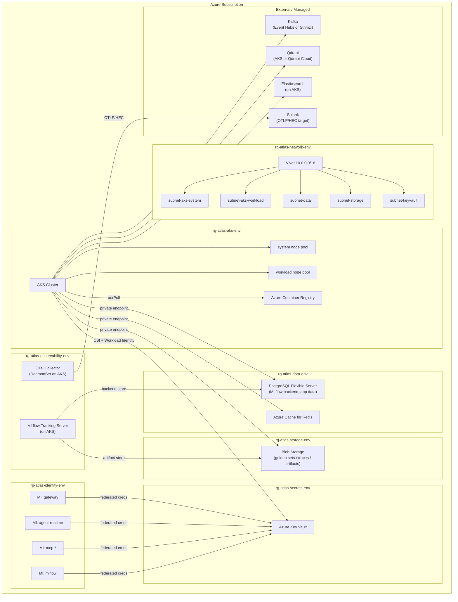
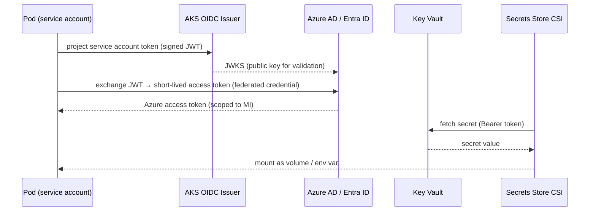
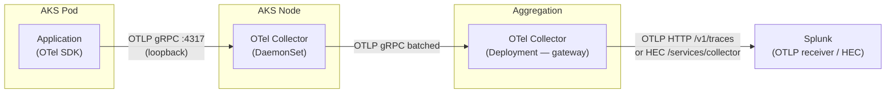

# 04 — Infrastructure, CI/CD & Observability

> **Scope:** Azure topology, Terraform layout, identity & secrets model, Helm charts, Bitbucket Pipelines three-gate strategy, and the full observability stack for the Atlas platform.
>
> **Repo layout (polyrepo):** Atlas is split across 8 git repos — `atlas-docs`, `atlas-gateway`, `atlas-agent-runtime`, `atlas-mcp-doc-search`, `atlas-mcp-citations`, `atlas-frontend` (Angular + TS), `atlas-infra` (Terraform + platform charts + umbrella dev loop), `atlas-prompts` (prompts, agents, evals, eval-gate CI). Each service repo owns its own `deploy/` Helm chart; `atlas-infra` owns platform/third-party charts and Terraform.

---

## Table of Contents

1. [Azure Topology](#1-azure-topology)
2. [Terraform Module Layout](#2-terraform-module-layout)
3. [Identity & Secrets](#3-identity--secrets)
4. [Helm Charts & Dev Loop](#4-helm-charts--dev-loop)
5. [Bitbucket Pipelines — Three Gates](#5-bitbucket-pipelines--three-gates)
6. [Observability](#6-observability)
7. [Differentiator Callout](#7-differentiator-callout)

---

## 1. Azure Topology

### 1.1 Resource Groups

| Resource Group | Contents |
|---|---|
| `rg-atlas-network-<env>` | VNet, subnets, NSGs, private DNS zones |
| `rg-atlas-aks-<env>` | AKS cluster, node pools, ACR |
| `rg-atlas-data-<env>` | PostgreSQL Flexible Server, Redis Cache |
| `rg-atlas-storage-<env>` | Blob Storage accounts (artifacts, traces, golden sets) |
| `rg-atlas-secrets-<env>` | Key Vault |
| `rg-atlas-identity-<env>` | User-Assigned Managed Identities, federated credentials |
| `rg-atlas-observability-<env>` | OTel Collector resources, Log Analytics (if used), MLflow App |

`<env>` = `dev` | `prod`. All resources share a single Azure subscription per environment; prod optionally lives in a dedicated subscription for blast-radius isolation.

### 1.2 Networking

```
VNet: 10.0.0.0/16
├── subnet-aks-system    10.0.0.0/22   (AKS system node pool)
├── subnet-aks-workload  10.0.4.0/22   (AKS workload node pool)
├── subnet-data          10.0.8.0/24   (PG Flexible Server private endpoint, Redis)
├── subnet-storage       10.0.9.0/28   (Blob private endpoint)
├── subnet-keyvault      10.0.9.16/28  (Key Vault private endpoint)
└── subnet-appgw         10.0.10.0/28  (Application Gateway / ingress, prod only)
```

- All Azure PaaS services bound via **private endpoints** — no public internet egress for data plane.
- NSGs enforce least-privilege ingress/egress per subnet.
- Private DNS zones registered for `privatelink.postgres.database.azure.com`, `privatelink.blob.core.windows.net`, `privatelink.vaultcore.azure.net`.

### 1.3 AKS Cluster

| Node Pool | Purpose | Recommended SKU (dev) | Recommended SKU (prod) |
|---|---|---|---|
| `system` | kube-system, critical addons | `Standard_D2pds_v5` (2 vCPU, 8 GB, Arm64) | `Standard_D4ds_v5` |
| `workload` | Atlas services, Qdrant, Kafka (if Strimzi) | `Standard_B4ms` burstable | `Standard_D8ds_v5` with autoscale |
| `gpu` (optional) | Local embedding inference | — | `Standard_NC6s_v3` spot |

- Arm64 (`Dpds`/`Dpsv5`) burstable SKUs offer the best cost/core for bursty workloads in dev.
- Cluster Autoscaler enabled on workload pool (`min=1 max=10` dev, `min=2 max=20` prod).
- Workload Identity add-on enabled at cluster creation (`--enable-oidc-issuer --enable-workload-identity`).
- Azure CNI Overlay networking; pod CIDR separate from node CIDR.

### 1.4 Container Registry

- **Azure Container Registry** (ACR) — Premium SKU (geo-replication optional for prod; required for multi-region).
- ACR integrated with AKS via `--attach-acr` or the `acrPull` role assignment on the kubelet identity.
- Tasks disabled; all image builds run in Bitbucket Pipelines and push via OIDC-scoped service principal.

### 1.5 Kafka Choice

Two valid options; one is recommended per environment:

| Option | Description | Recommendation |
|---|---|---|
| **Azure Event Hubs Kafka endpoint** | Fully managed, zero-ops, scales automatically. Kafka-protocol compatible (1.0+). | **Recommended for dev** — zero cluster management, pay-per-throughput. |
| **Strimzi on AKS** | Self-managed Kafka on the workload node pool via the Strimzi operator. Full Kafka semantics, topic compaction, Kafka Streams. | **Recommended for prod** if full Kafka semantics (compaction, streams, connector ecosystem) are required; otherwise Event Hubs is sufficient. |

For Atlas dev: use Event Hubs Kafka endpoint to eliminate operational overhead. For prod: evaluate Strimzi if connector ecosystem (Debezium CDC, Kafka Streams) is needed; otherwise Event Hubs Premium tier is sufficient.

### 1.6 Azure Topology Diagram



---

## 2. Terraform Module Layout

### 2.1 Directory Structure

All Terraform lives in the **`atlas-infra`** repo.

```
infra/
└── terraform/
    ├── modules/
    │   ├── network/          # VNet, subnets, NSGs, private DNS zones
    │   ├── aks/              # AKS cluster, node pools, OIDC issuer, addons
    │   ├── data/             # PostgreSQL Flexible Server, Redis Cache
    │   ├── storage/          # Blob Storage accounts, ACR
    │   ├── identity/         # User-assigned MIs, federated credentials, role assignments
    │   └── secrets/          # Key Vault, access policies / RBAC, CSI provider config
    ├── bootstrap/            # one-shot state backend bootstrap
    └── envs/
        └── dev/
            ├── main.tf       # module calls with dev-sized vars
            ├── variables.tf
            └── backend.tf    # Azure Storage state backend (dev container)

platform/                     # Helm charts for platform / third-party services (not TF modules)
    ├── qdrant/               # Qdrant Helm chart
    ├── kafka/                # Strimzi operator + Kafka CR
    ├── elasticsearch/        # Elasticsearch Helm chart
    ├── mlflow/               # MLflow Helm chart
    ├── otel-collector/       # OTel Collector Helm chart (DaemonSet + Deployment)
    └── cost-controls/        # scale-to-zero CronJob
```

> **Note:** Kafka and the OTel/MLflow observability stack are deployed as **Helm charts** in `atlas-infra/platform/` (managed by Skaffold / `make cloud-up`), not as Terraform modules. Terraform provisions only the Azure PaaS layer (network, AKS, data, storage, identity, secrets).

### 2.2 State Backend

```hcl
# envs/dev/backend.tf
terraform {
  backend "azurerm" {
    resource_group_name  = "rg-atlas-tfstate"
    storage_account_name = "satlaststatedev"        # env-specific SA
    container_name       = "tfstate"
    key                  = "atlas-dev.tfstate"
    # State locking via Azure Blob lease — no external lock table needed
  }
}
```

- State storage account is provisioned once, manually or via a bootstrap script, before any `terraform init`.
- Blob lease provides automatic exclusive locking; no DynamoDB or equivalent required.
- State files are versioned (Blob versioning enabled) and soft-deleted (7-day retention).
- **Access:** The Bitbucket Pipeline authenticates to Azure via OIDC federated credential (no long-lived key); the pipeline service principal holds `Storage Blob Data Contributor` on the state container only.

### 2.3 Provider Pinning

```hcl
# modules/*/versions.tf  (identical in every module)
terraform {
  required_providers {
    azurerm = {
      source  = "hashicorp/azurerm"
      version = "~> X.Y"   # pin exact minor at lock time; update intentionally
    }
    helm = {
      source  = "hashicorp/helm"
      version = "~> X.Y"
    }
    kubernetes = {
      source  = "hashicorp/kubernetes"
      version = "~> X.Y"
    }
  }
}
```

> **Rule:** never use `latest` or an unbound `>=`. Version ranges are tightened to `~> major.minor` so patch upgrades are automatic but minor/major changes require a deliberate diff.

### 2.4 Module Responsibilities (summary)

**Terraform modules** (`infra/terraform/modules/`):

| Module | Key Resources |
|---|---|
| `network` | `azurerm_virtual_network`, subnets, NSGs, private DNS zones, private endpoints |
| `aks` | `azurerm_kubernetes_cluster`, node pools, OIDC issuer URL output, ACR attachment |
| `data` | `azurerm_postgresql_flexible_server`, `azurerm_redis_cache`, private endpoints |
| `storage` | `azurerm_storage_account` × 2 (artifacts, golden-sets), `azurerm_container_registry` |
| `identity` | `azurerm_user_assigned_identity` per service, `azurerm_federated_identity_credential` per service account, `azurerm_role_assignment` (least-privilege) |
| `secrets` | `azurerm_key_vault`, RBAC role assignments, `SecretProviderClass` manifest |

**Platform Helm charts** (`platform/`) — deployed by Skaffold/`make cloud-up`, not by Terraform:

| Chart | Notes |
|---|---|
| `qdrant` | Qdrant vector store |
| `kafka` | Strimzi operator + `Kafka` CR (prod) or Azure Event Hubs endpoint (dev) |
| `elasticsearch` | Elasticsearch document and log index |
| `mlflow` | MLflow tracking server (PostgreSQL backend + Blob artifacts) |
| `otel-collector` | OTel Collector DaemonSet + Deployment (OTLP → Splunk HEC) |
| `cost-controls` | Scale-to-zero CronJob |

---

## 3. Identity & Secrets

### 3.1 AKS Workload Identity — End-to-End Flow



**Key points:**

- Each service (gateway, agent-runtime, mcp-doc-search, …) has its own `User-Assigned Managed Identity`.
- The Kubernetes `ServiceAccount` is annotated with `azure.workload.identity/client-id: <MI client ID>`.
- An `azurerm_federated_identity_credential` binds the OIDC issuer URL + service account namespace/name to the MI.
- The pod spec carries `azure.workload.identity/use: "true"`.
- The Secrets Store CSI driver mounts Key Vault secrets as files; the application reads from the filesystem — **no secret ever appears in an env var baked into the image or in a Kubernetes `Secret` in plain text**.

### 3.2 Per-Service Least-Privilege Role Assignments

| Service | MI | Key Vault role | Other roles |
|---|---|---|---|
| `gateway` (`atlas-gateway`) | `mi-atlas-gateway` | `Key Vault Secrets User` | — |
| `agent-runtime` (`atlas-agent-runtime`) | `mi-atlas-agent-runtime` | `Key Vault Secrets User` | `Storage Blob Data Reader` (trace read) |
| `mcp-doc-search` (`atlas-mcp-doc-search`) | `mi-atlas-mcp-doc-search` | `Key Vault Secrets User` | — |
| `mcp-citations` (`atlas-mcp-citations`) | `mi-atlas-mcp-citations` | `Key Vault Secrets User` | — |
| `frontend` (`atlas-frontend`) | `mi-atlas-frontend` | — | — (nginx static SPA; no Key Vault access needed) |
| `mlflow` | `mi-atlas-mlflow` | `Key Vault Secrets User` | `Storage Blob Data Contributor` (artifact write) |
| `otel-collector` | `mi-atlas-otel-collector` | `Key Vault Secrets User` | — |
| Terraform / CI (`atlas-infra` + per-repo pipelines) | Service Principal (OIDC) | `Key Vault Administrator` (bootstrap only) | `Contributor` scoped to target RGs |
| `atlas-prompts` CI | Service Principal (OIDC) | — (CI only; no runtime workload) | `Storage Blob Data Reader` (golden-set read) |

### 3.3 NFR2 Enforcement — Zero Secrets in Code or Images

| Layer | Control |
|---|---|
| **Source** | Pre-commit hook + Bitbucket Pipelines step: `trufflehog` / `detect-secrets` scan on every push. PR blocked if secrets detected. |
| **Image build** | Dockerfiles use build args only for non-secret config. No `ENV SECRET=` lines. Images contain zero credentials. |
| **Kubernetes** | `SecretProviderClass` syncs from Key Vault. Native `Secret` objects not used for sensitive values. |
| **CI auth to Azure** | Bitbucket OIDC → Entra ID federated credential. No `ARM_CLIENT_SECRET` or long-lived key in pipeline variables. |
| **IaC** | `terraform.tfvars` never committed. Sensitive outputs marked `sensitive = true`. State backend protected by Azure RBAC. |
| **Runtime** | Applications read secrets from CSI-mounted volume paths (e.g., `/mnt/secrets/openai-key`). No secret in env vars visible to `kubectl describe pod`. |

### 3.4 CI Authentication to Azure (OIDC)

```yaml
# Bitbucket pipeline — OIDC token exchange (illustrative)
# No ARM_CLIENT_SECRET in repository variables
- pipe: atlassian/azure-cli:X.Y.Z
  variables:
    AZURE_TENANT_ID: $AZURE_TENANT_ID          # not a secret
    AZURE_CLIENT_ID: $AZURE_CLIENT_ID_CICD     # not a secret (public MI client ID)
    AZURE_SUBSCRIPTION_ID: $AZURE_SUBSCRIPTION_ID
    # OIDC token issued by Bitbucket; exchanged for Azure access token at runtime
    OIDC_TOKEN: $BITBUCKET_STEP_OIDC_TOKEN
```

Entra ID federated credential configured for:
- `issuer`: `https://api.bitbucket.org/2.0/workspaces/<workspace>/pipelines-config/identity/oidc`
- `subject`: `{<repo-uuid>}:{<env>}:pipeline` (scoped per environment)

---

## 4. Helm Charts & Dev Loop

### 4.1 Chart Inventory

**Per-service charts** — each service repo owns its `deploy/` Helm chart (`<repo>/deploy/`):

| Repo | Chart location | Image | Notes |
|---|---|---|---|
| `atlas-gateway` | `atlas-gateway/deploy/` | `acr.azurecr.io/atlas/gateway` | LLM proxy, rate limiting, auth |
| `atlas-agent-runtime` | `atlas-agent-runtime/deploy/` | `acr.azurecr.io/atlas/agent-runtime` | Orchestrator, tool dispatch |
| `atlas-mcp-doc-search` | `atlas-mcp-doc-search/deploy/` | `acr.azurecr.io/atlas/mcp-doc-search` | MCP server, ES-backed |
| `atlas-mcp-citations` | `atlas-mcp-citations/deploy/` | `acr.azurecr.io/atlas/mcp-citations` | MCP server, citation grounding |
| `atlas-frontend` | `atlas-frontend/deploy/` | `acr.azurecr.io/atlas/frontend` | nginx static SPA; Argo Rollouts canary |

**Platform / third-party charts** — owned by **`atlas-infra`**:

| Chart | Image | Notes |
|---|---|---|
| `qdrant` | upstream `qdrant/qdrant` | Vector store; or point to Qdrant Cloud |
| `kafka` | Strimzi operator + `Kafka` CR (prod) | Or omit for Event Hubs |
| `elasticsearch` | upstream `elastic/elasticsearch` | Document index |
| `mlflow` | upstream `bitnami/mlflow` or custom | Experiment tracking |
| `otel-collector` | upstream `open-telemetry/opentelemetry-collector` | DaemonSet + Deployment modes |

### 4.2 Standard Chart Structure

Each service repo contains a `deploy/` directory with a self-contained Helm chart. Example for `atlas-gateway`:

```
atlas-gateway/
└── deploy/
    ├── Chart.yaml
    ├── values.yaml            # defaults (image tag, replica count, resource requests)
    ├── values-dev.yaml        # dev overrides (smaller resources, 1 replica)
    ├── values-prod.yaml       # prod overrides (HPA, PDB, larger resources)
    └── templates/
        ├── deployment.yaml
        ├── service.yaml
        ├── serviceaccount.yaml     # annotated with MI client-id
        ├── secretproviderclass.yaml  # Key Vault → CSI mount
        ├── hpa.yaml
        ├── poddisruptionbudget.yaml
        ├── servicemonitor.yaml     # OTel / Prometheus scrape target (if applicable)
        ├── rollout.yaml            # Argo Rollouts canary spec (replaces Deployment in prod)
        └── _helpers.tpl
```

Illustrative `values.yaml` excerpt:

```yaml
# atlas-gateway/deploy/values.yaml
replicaCount: 2

image:
  repository: acr.azurecr.io/atlas/gateway
  tag: ""          # overridden at deploy time with git SHA
  pullPolicy: IfNotPresent

serviceAccount:
  annotations:
    azure.workload.identity/client-id: ""   # injected by Terraform output / CI

secrets:
  keyVaultName: ""           # injected per env
  tenantId: ""               # injected per env
  secretObjects:
    - objectName: openai-api-key
      type: Opaque

resources:
  requests:
    cpu: "250m"
    memory: "256Mi"
  limits:
    cpu: "1000m"
    memory: "1Gi"

canary:
  enabled: false   # true in prod via values-prod.yaml; uses Argo Rollouts
```

### 4.3 AKS-Only Dev Loop (no docker-compose)

The dev loop runs entirely against AKS dev namespace — no local compose stack.

The **umbrella Skaffold config lives in `atlas-infra`** (Skaffold is the chosen dev-loop tool — see ADR-019). It references each service repo's source directory as a build context and each service's own `deploy/` chart. `make cloud-up ENV=dev` (also in `atlas-infra`) deploys all services from published ACR images without a local build.

#### Skaffold (chosen — ADR-019)

```yaml
# atlas-infra/skaffold.yaml (illustrative — umbrella across all service repos)
apiVersion: skaffold/v4beta6
kind: Config
metadata:
  name: atlas

build:
  artifacts:
    - image: acr.azurecr.io/atlas/gateway
      context: ../atlas-gateway          # sibling repo checkout
      docker:
        dockerfile: Dockerfile
    - image: acr.azurecr.io/atlas/agent-runtime
      context: ../atlas-agent-runtime
    - image: acr.azurecr.io/atlas/mcp-doc-search
      context: ../atlas-mcp-doc-search
    - image: acr.azurecr.io/atlas/mcp-citations
      context: ../atlas-mcp-citations
    - image: acr.azurecr.io/atlas/frontend
      context: ../atlas-frontend
  tagPolicy:
    gitCommit: {}
  local:
    push: true          # push to ACR; AKS pulls from there

deploy:
  helm:
    releases:
      - name: gateway
        chartPath: ../atlas-gateway/deploy      # per-repo chart
        valuesFiles:
          - ../atlas-gateway/deploy/values-dev.yaml
        setValues:
          image.tag: "{{.IMAGE_TAG}}"
      - name: agent-runtime
        chartPath: ../atlas-agent-runtime/deploy
        valuesFiles:
          - ../atlas-agent-runtime/deploy/values-dev.yaml
      - name: mcp-doc-search
        chartPath: ../atlas-mcp-doc-search/deploy
        valuesFiles:
          - ../atlas-mcp-doc-search/deploy/values-dev.yaml
      - name: mcp-citations
        chartPath: ../atlas-mcp-citations/deploy
        valuesFiles:
          - ../atlas-mcp-citations/deploy/values-dev.yaml
      - name: frontend
        chartPath: ../atlas-frontend/deploy
        valuesFiles:
          - ../atlas-frontend/deploy/values-dev.yaml

profiles:
  - name: dev
    activation:
      - kubeContext: atlas-dev
```

Run: `skaffold dev --profile=dev --namespace=atlas-dev`

#### Alternative considered: Tilt (not adopted — see ADR-019)

```python
# atlas-infra/Tiltfile (illustrative)
load('ext://helm_resource', 'helm_resource')

docker_build(
    'acr.azurecr.io/atlas/gateway',
    '../atlas-gateway',
    live_update=[sync('../atlas-gateway/src', '/app/src')]
)

helm_resource(
    'gateway',
    '../atlas-gateway/deploy',
    flags=['--values', '../atlas-gateway/deploy/values-dev.yaml'],
    namespace='atlas-dev'
)
```

Both tools watch source files, rebuild only changed images, push to ACR, and execute `helm upgrade` against the `atlas-dev` namespace — the feedback loop is seconds, not minutes.

### 4.4 Inter-Repo API Contract (OpenAPI)

- **`atlas-gateway`** publishes an OpenAPI spec (`openapi.yaml`) as the authoritative contract for all clients.
- **`atlas-frontend`** codegen step (`npx openapi-typescript`) runs during its CI pipeline and regenerates TypeScript types from the gateway's published spec. The generated types are committed to `atlas-frontend/src/api/` and checked in CI — type drift fails the Gate 1 step.
- **Python service repos** (`atlas-agent-runtime`, `atlas-mcp-*`) reference a generated Python client derived from the same spec for any inter-service HTTP calls.
- This contract-first flow means the spec is the single source of truth; downstream repos cannot silently diverge.

### 4.5 Cost Controls

| Control | Mechanism |
|---|---|
| Scale workloads to zero off-hours | KEDA `ScaledObject` with cron trigger (scale to 0 at 20:00, restore at 08:00 CEST weekdays) |
| One-command dev stack up | `make cloud-up ENV=dev` in `atlas-infra` deploys all services from published ACR images via per-repo `deploy/` charts |
| Small dev SKUs | `values-dev.yaml` requests/limits; burstable node pool SKUs |
| Cluster autoscaler | `min=0` on workload node pool (scale entire pool to zero when no workloads) |
| `terraform destroy` dev when idle | CI schedule job (`nightly-cost-check`); dev stack destroyable with single pipeline run |
| Spot instances for GPU pool | Azure Spot VMs with eviction policy `Deallocate` |

---

## 5. Bitbucket Pipelines — Three Gates

> **Design principle:** AI services require a third CI/CD gate — _quality_ (eval regressions) — in addition to the standard _correctness_ (tests) and _safety_ (canary) gates. This is the Atlas CI/CD differentiator.

### 5.1 Gate Summary

Atlas uses **one Bitbucket pipeline per repo** generated from a shared template. The three gates map across repos as follows:

| Gate | Repo(s) | When | What | Blocker? |
|---|---|---|---|---|
| **Gate 1 — Correctness** | Every repo | Every PR | `ruff` + `pyright --strict` + `pytest` (MockProvider, fakeredis, ephemeral PG) | Yes — PR merge blocked |
| **Gate 2 — Quality** | **`atlas-prompts`** pipeline only | PRs touching `prompts/**` or `agents/**` | Eval runner vs versioned golden set; metric diff posted to PR; regression blocks merge | Yes — required status check |
| **Gate 3 — Safety** | Each service repo | Every merge to `main` | Build → push ACR → Helm deploy (per-service `deploy/` chart) → Argo Rollouts canary (10%) → SLO watch → promote or rollback | Yes — deployment gated on SLO health |

### 5.2 `bitbucket-pipelines.yml` Structure

Each repo has its own `bitbucket-pipelines.yml` generated from a **shared pipeline template** stored in `atlas-infra`. The structure below is illustrative of the per-repo pattern; `atlas-prompts` additionally includes the Gate 2 eval steps.

```yaml
# bitbucket-pipelines.yml (per-repo — illustrative, not exhaustive)

image: python:3.12-slim

definitions:
  steps:
    - step: &lint-typecheck
        name: "Gate 1a — Lint & Typecheck"
        script:
          - pip install ruff pyright --quiet
          - ruff check .
          - pyright --strict

    - step: &unit-tests
        name: "Gate 1b — Unit Tests (zero API spend)"
        services: [postgres, redis]
        script:
          - pip install -r requirements-dev.txt --quiet
          - pytest tests/unit tests/integration
            --cov=atlas --cov-report=xml
            -x -q
        artifacts:
          - coverage.xml

    - step: &eval-gate
        name: "Gate 2 — Eval Quality Gate"
        # Runs only when prompts/** or agents/** changed (see condition below)
        script:
          - pip install -r requirements-dev.txt --quiet
          # Seed ephemeral test DB with golden fixtures
          - python scripts/seed_eval_db.py
          # Run eval suite; compare vs baseline stored in MLflow
          - python scripts/run_evals.py
              --golden-set gs://atlas-golden-sets/v${GOLDEN_SET_VERSION}
              --mlflow-uri ${MLFLOW_TRACKING_URI}
              --baseline-run-id ${BASELINE_EVAL_RUN_ID}
              --output eval-report.json
          # Post metric diff as PR comment (exit 1 on regression)
          - python scripts/post_eval_comment.py eval-report.json
        artifacts:
          - eval-report.json
        services: [postgres]

    - step: &build-push
        name: "Gate 3a — Build & Push to ACR"
        script:
          - az login --federated-token $BITBUCKET_STEP_OIDC_TOKEN
              --service-principal -u $AZURE_CLIENT_ID_CICD
              --tenant $AZURE_TENANT_ID
          - az acr login --name $ACR_NAME
          - docker build
              --build-arg GIT_SHA=$BITBUCKET_COMMIT
              -t $ACR_NAME.azurecr.io/atlas/$SERVICE:$BITBUCKET_COMMIT
              .                    # each repo is its own service root
          - docker push $ACR_NAME.azurecr.io/atlas/$SERVICE:$BITBUCKET_COMMIT

    - step: &helm-canary-deploy
        name: "Gate 3b — Helm Deploy → Canary"
        script:
          - az login --federated-token $BITBUCKET_STEP_OIDC_TOKEN
              --service-principal -u $AZURE_CLIENT_ID_CICD
              --tenant $AZURE_TENANT_ID
          - az aks get-credentials --resource-group rg-atlas-aks-prod --name atlas-aks-prod
          - helm upgrade --install $SERVICE deploy/
              --namespace atlas-prod
              --values deploy/values-prod.yaml
              --set image.tag=$BITBUCKET_COMMIT
              --atomic --timeout 5m
          # Argo Rollouts canary; promotion/rollback handled by controller watching SLOs
          - kubectl argo rollouts status $SERVICE -n atlas-prod --timeout 10m

  services:
    postgres:
      image: postgres:16-alpine
      environment:
        POSTGRES_USER: atlas_test
        POSTGRES_PASSWORD: test
        POSTGRES_DB: atlas_test
    redis:
      image: redis:7-alpine

pipelines:
  pull-requests:
    "**":
      - parallel:
          - step: *lint-typecheck
          - step: *unit-tests
      # Gate 2: conditional on changed paths
      - step:
          <<: *eval-gate
          condition:
            changesets:
              includePaths:
                - "prompts/**"
                - "agents/**"
                - "evals/**"

  branches:
    main:
      - parallel:
          - step: *lint-typecheck
          - step: *unit-tests
      - step:
          name: "Build & Push — This Service"
          script:
            # SERVICE is set as a repo-level pipeline variable in each service repo
            - *build-push
      - step: *helm-canary-deploy

  custom:
    nightly-evals:
      - step:
          name: "Nightly Eval Suite (K8s Jobs)"
          script:
            - kubectl apply -f k8s/jobs/nightly-eval-job.yaml -n atlas-prod
            - kubectl wait --for=condition=complete job/nightly-eval --timeout=60m -n atlas-prod
```

### 5.3 How Gate 2 Blocks Merge

1. The `eval-gate` step is a **required status check** in the Bitbucket branch permissions for all PRs targeting `main`.
2. `run_evals.py` fetches the baseline `run_id` from MLflow (tagged `baseline=true` for the current golden-set version), computes metric deltas, and writes `eval-report.json`.
3. If any metric regresses beyond configured thresholds (e.g., judge score drops > 2%, task success rate drops > 1%), the script exits with code 1 — the pipeline step fails.
4. `post_eval_comment.py` always posts the metric diff table to the PR (pass or fail), so reviewers can see the impact.
5. With the step marked required, Bitbucket prevents merge until the step passes (or a project admin overrides with documented justification).

### 5.4 Canary Rollout & Auto-Rollback (Gate 3)

```yaml
# atlas-gateway/deploy/templates/rollout.yaml (Argo Rollouts — illustrative; same pattern in every service repo)
apiVersion: argoproj.io/v1alpha1
kind: Rollout
spec:
  strategy:
    canary:
      steps:
        - setWeight: 10       # 10% of traffic to canary pods
        - pause: {duration: 5m}
        - analysis:
            templates:
              - templateName: slo-check
        - setWeight: 50
        - pause: {duration: 5m}
        - analysis:
            templates:
              - templateName: slo-check
      autoPromotionEnabled: false
      # AnalysisTemplate checks: error_rate, p95_latency, guardrail_block_rate
      # Failure → automatic rollback to previous stable revision
```

SLO thresholds (configured in `AnalysisTemplate`):

| SLO | Threshold | Auto-rollback trigger |
|---|---|---|
| HTTP error rate | < 1% | > 2% sustained 3 min |
| p95 latency | < 2 s | > 5 s sustained 3 min |
| Guardrail block rate | < 5% | > 15% sustained 3 min |

---

## 6. Observability

### 6.1 OTel SDK → Collector → Splunk Wiring



- **DaemonSet collector:** receives from pod, does local sampling/filtering (drop health-check spans), forwards batched to aggregation collector.
- **Deployment (gateway) collector:** handles tail-based sampling, enriches with Kubernetes resource attributes, exports to Splunk via OTLP or HEC.
- **`OTEL_SEMCONV_STABILITY_OPT_IN=gen_ai_latest_experimental`** set in all pod env vars to enable GenAI semantic conventions.

### 6.2 GenAI Semantic Convention Attributes

All LLM calls are instrumented with the following span attributes per the OpenTelemetry GenAI semconv spec:

| Attribute | Example Value |
|---|---|
| `gen_ai.system` | `openai` |
| `gen_ai.request.model` | `gpt-4o` |
| `gen_ai.request.max_tokens` | `4096` |
| `gen_ai.response.model` | `gpt-4o-2024-08-06` |
| `gen_ai.response.finish_reasons` | `["stop"]` |
| `gen_ai.usage.input_tokens` | `512` |
| `gen_ai.usage.output_tokens` | `128` |
| `gen_ai.usage.total_tokens` | `640` |
| `gen_ai.prompt_template.id` | `answer-v3` |
| `atlas.guardrail.triggered` | `false` |
| `atlas.agent.loop_depth` | `2` |
| `atlas.cache.hit` | `true` |

> **PII policy:** raw prompt/completion text is NOT logged or exported as span attributes. Message content is either omitted or tokenised/hashed. This is enforced in the OTel SDK instrumentation wrapper, not left to individual service authors.

### 6.3 MLflow Tracking

MLflow tracks:

| Tracked Entity | Details |
|---|---|
| **Eval runs** | Every Gate 2 execution: golden-set version, run timestamp, per-metric scores |
| **Judge scores** | Per-question LLM-judge scores (faithfulness, relevance, groundedness) |
| **Prompt-version experiments** | Each `prompts/**` change creates a named experiment; runs compare versions |
| **Cost / latency over time** | Token counts + model pricing logged as metrics; p50/p95 latency per route |
| **Baseline tagging** | Promoted run tagged `baseline=true`; Gate 2 diffs against it |

Artifact storage: all eval artefacts (judge outputs, traces, golden-set snapshots) stored in Azure Blob Storage via MLflow artifact store. Backend store (run metadata, metrics) in Azure PostgreSQL Flexible Server.

### 6.4 Dashboards & SLOs

#### Splunk Dashboards

| Dashboard | Key Panels |
|---|---|
| **Cost** | Token spend per app / model / day; cumulative monthly forecast |
| **Latency** | p50 / p95 / p99 per route; histogram; slow-path breakdown (cache miss, tool call, guardrail) |
| **Reliability** | HTTP error rate; guardrail trigger rate; canary rollback events |
| **Cache** | Semantic cache hit rate; cold-start vs warm ratio |
| **Agent behaviour** | Loop-depth distribution; tool call frequency; abandon rate |
| **Eval trends** | Judge score time-series from MLflow; regression events |

#### SLO Definitions

| SLO | Objective | Measurement Window |
|---|---|---|
| API availability | ≥ 99.5% | 28-day rolling |
| p95 response latency | < 2 s (non-streaming) | 1-hour rolling |
| Guardrail block rate | < 5% of requests | 24-hour rolling |
| Eval score (faithfulness) | ≥ 0.85 weighted mean | Per-deploy gate |
| Eval score (task success) | ≥ 0.90 | Per-deploy gate |
| Cache hit rate | ≥ 40% (post-warm-up) | 24-hour rolling |

### 6.5 Log Handling

- Structured JSON logs only (no free-form string concatenation).
- Log level controlled via `LOG_LEVEL` env var (default `INFO` in prod, `DEBUG` in dev).
- Logs shipped via OTel Collector log receiver → Splunk HEC.
- **No raw PII in logs:** user query text is replaced with `[REDACTED]` at the instrumentation boundary before emission. PII detection runs in the OTel Collector processor pipeline (attribute redaction processor) as a second line of defence.
- Retention: 90 days hot (Splunk), 365 days cold (Blob archive tier).

---

## 7. Differentiator Callout

> **AI services add a third CI/CD gate — quality (evals) — alongside correctness (tests) and safety (canary).**

Traditional software CI/CD has two gates:
1. **Correctness** — do the unit and integration tests pass?
2. **Safety** — does the canary deployment hold SLOs under real traffic?

AI systems introduce a third dimension that neither gate covers: **semantic quality**. A change that passes all tests and holds latency SLOs can still silently regress answer quality — a prompt tweak that changes wording, a retrieval parameter adjustment, or a model version upgrade.

Atlas makes this gate a first-class, merge-blocking step in every PR that touches prompts, agent logic, or eval configurations:

```
Gate 1 — Correctness  →  Gate 2 — Quality (evals)  →  Gate 3 — Safety (canary)
    tests pass              judge scores ≥ baseline         SLOs hold at 10% traffic
    lint clean              metric diff posted to PR         auto-rollback on breach
    zero API spend          blocks merge on regression       promotes to 100% or rolls back
```

This three-gate model is the structural answer to the question: *"How do we ship LLM-powered features with the same rigour as deterministic software?"*

---

*Document version: 2026-06-06. Canonical facts sourced from Atlas architecture decision log. All version numbers marked for pinning at lock time.*
