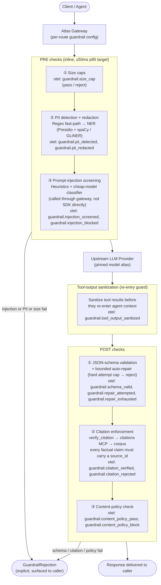

# 05 — Guardrails & Security

> **Scope.** This document covers the guardrail middleware chain, per-route configuration, threat model, failure-mode mitigations, and the full security and secrets strategy for Atlas.

---

## 1. Guardrail Chain Architecture

Every request flowing through the Atlas gateway passes through a deterministic middleware chain. Guardrails are **per-route**, **declarative**, and **fail-fast**: a failure always raises an explicit `GuardrailRejection`; nothing is silently swallowed. Each check emits an OpenTelemetry (OTel) metric so the chain is fully observable.

### 1.1 Pipeline Diagram



### 1.2 Per-Route Configuration Model

Guardrails are declared in the route manifest. Each route carries an ordered list of check stanzas; the gateway evaluates them in sequence and short-circuits on first failure.

```yaml
# example route config (no secrets — env vars and Key Vault refs only)
routes:
  - id: "chat.v1"
    model_alias: "atlas.gpt4o.v1"
    pre_checks:
      - type: size_cap
        max_tokens: 8192
      - type: pii
        mode: redact          # or: reject
        ner_offload: true     # push heavy NER off inline path
      - type: injection
        heuristics: true
        classifier: true
    post_checks:
      - type: schema_validation
        schema_ref: "schemas/chat_response.json"
        max_repair_attempts: 2   # hard cap; reject on exhaustion
      - type: citation_enforcement
        require_source_ids: true
      - type: content_policy
```

Each check stanza maps 1-to-1 to an OTel metric namespace (`guardrail.<check_type>.*`), enabling per-route, per-check dashboards and alerting without code changes.

---

## 2. PRE Checks in Detail

### 2.1 PII Detection & Redaction

**Goal:** prevent raw PII from ever reaching the provider or appearing in logs/traces.

| Step | Mechanism | Rationale |
|------|-----------|-----------|
| Regex fast-path | Pattern library (emails, phone numbers, SSNs, credit-card patterns, etc.) | Sub-millisecond; covers the majority of high-confidence PII |
| NER slow-path | Presidio + pinned spaCy model **or** GLiNER (route-configured) | Higher recall on free-text entities (names, addresses, org names) |

**Latency strategy.** The gateway enforces a **≤50ms p95 inline latency budget** for the entire PRE chain. Regex runs inline always. NER is **offloaded off the inline path** (`ner_offload: true` per route) — the gateway redacts regex hits immediately and enqueues the NER pass asynchronously, or fans it out to a sidecar where the request can tolerate the added latency. For routes where NER must be synchronous (e.g., high-sensitivity data-room queries), the route manifest explicitly opts in and accepts the latency trade-off.

Detected PII is replaced with a typed placeholder (e.g., `[PII:EMAIL]`, `[PII:PERSON]`). **Raw PII is never written to logs or traces** — only the placeholder token and a count are emitted (see §6).

OTel metrics: `guardrail.pii_detected{route, entity_type}`, `guardrail.pii_redacted{route, entity_type}`.

### 2.2 Prompt-Injection Screening

**Goal:** block direct injection in user input **and** injection smuggled via tool results.

**Input screening** applies two layers:

1. **Heuristics** — fast rule set (instruction-override phrases, role-play escalation patterns, delimiter injection). Runs inline; cheap.
2. **Cheap-model classifier** — a fine-tuned binary classifier (injection vs. benign) served as a gateway-internal endpoint.

**Why the classifier is called through the gateway, not the SDK directly.** All model calls — including safety classifiers — route through the gateway so they inherit rate-limiting, circuit-breaking, cost attribution, and audit logging. Calling the SDK directly would create an unobserved, unmetered side-channel that bypasses budget enforcement and breaks the single-pane audit trail.

**Tool-output sanitization.** Before any tool result re-enters the agent context window, the gateway runs the same heuristic + classifier pass against the tool output. This closes the indirect-injection vector: a malicious document retrieved by a search tool cannot inject instructions into the agent's next prompt turn.

OTel metrics: `guardrail.injection_screened`, `guardrail.injection_blocked{stage}` where `stage ∈ {input, tool_output}`.

### 2.3 Input Size Caps

A hard token-count cap is enforced before any other work. Oversized requests are rejected immediately with a `GuardrailRejection(reason=SIZE_CAP_EXCEEDED)`. This prevents prompt-stuffing attacks and runaway tokenization costs before they touch the provider.

OTel metric: `guardrail.size_cap{route, outcome}`.

---

## 3. POST Checks in Detail

### 3.1 JSON-Schema Validation & Bounded Auto-Repair

Provider responses that must conform to a declared JSON schema are validated immediately post-generation.

- **Happy path:** response validates → pass.
- **Soft fail:** schema mismatch → auto-repair attempt (e.g., a constrained re-prompt or structural fixup). The **maximum number of repair attempts is hard-capped in the route config** (default: 2). On exhaustion the request is rejected with `GuardrailRejection(reason=SCHEMA_REPAIR_EXHAUSTED)` — it is never silently truncated or passed with an invalid payload.

OTel metrics: `guardrail.schema_valid`, `guardrail.repair_attempted{attempt_n}`, `guardrail.repair_exhausted`.

### 3.2 Citation Enforcement

**This is a platform-level capability, not an application feature** — see §7.

Every factual claim in a response must be backed by a `source_id` referencing a document-search result from the Atlas corpus. Enforcement flow:

1. The response is parsed for claim annotations carrying `source_id` fields.
2. Each `source_id` is verified via a `verify_citation` call to the **citations MCP server**, which checks the id against the indexed corpus to confirm the source exists and the claim is attributable.
3. Any response containing unverified or missing citations is rejected (`GuardrailRejection(reason=CITATION_UNVERIFIED)`).

This prevents hallucinated references and ensures every answer is traceable to a real ingested document.

OTel metrics: `guardrail.citation_verified{route}`, `guardrail.citation_rejected{route, reason}`.

### 3.3 Content-Policy Check

A final content-policy pass screens the response for policy violations (harmful content, inappropriate outputs, policy-scoped topic restrictions). Violations raise `GuardrailRejection(reason=CONTENT_POLICY_VIOLATION)`.

OTel metric: `guardrail.content_policy_pass`, `guardrail.content_policy_block{category}`.

---

## 4. Threat Model

> **XCUT-5 validation (2026-06-07).** The table below has been validated against the shipped codebase. Each threat row now carries: the ticket(s) that implement the mitigation, the primary code location, a test file that pins the behaviour, and any residual risk or known gap.

| Threat | Atlas Mitigation | Ticket(s) | Code location | Test | Residual risk / gap |
|--------|-----------------|-----------|---------------|------|---------------------|
| **Direct prompt injection** — malicious instructions in user input | PRE heuristics (GRD-4) + cheap-model classifier via gateway (GRD-5); fail-fast `GuardrailRejection`; classifier is gateway-routed so it is accounted and traced | GRD-4, GRD-5 | `app/guardrails/injection.py`, `app/guardrails/injection_classifier.py` | `test_injection.py`, `test_injection_classifier.py` | Heuristics fire on benign content discussing injection (accepted, documented in code). GRD-5 classifier is a stand-in gateway call; real fine-tuned model is deferred. |
| **Indirect prompt injection via tool results** — malicious payloads smuggled through MCP tool outputs | Tool-output sanitization (GRD-6) strips zero-width/control chars, defangs forged role turns, brackets injection imperatives before tool results re-enter agent context | GRD-6, AGT-5 | `app/guardrails/tool_sanitize.py` (gateway); `app/tools/sanitize/sanitizer.py` (agent-runtime) | `test_tool_sanitize.py` (gateway); `test_sanitizer.py` (agent-runtime) | Sanitizer does not make a semantic judgment — sufficiently novel payloads may pass. GRD-5 classifier is not currently wired to tool outputs in the agent-runtime path. |
| **PII leakage to provider or logs** | Regex fast-path (GRD-2) redacts common PII before provider call; NER stand-in (GRD-3) catches novel formats off the inline path; OTel spans never include raw message text; rejection reasons never echo raw PII | GRD-2, GRD-3, GRD-12 | `app/guardrails/pii.py`, `app/guardrails/pii_ner.py`, `app/telemetry/otel.py` | `test_pii.py`, `test_pii_ner.py`, `test_telemetry.py` (`test_no_message_text_on_span`) | GRD-3 ships a pattern-based stand-in; the Presidio + pinned spaCy / GLiNER model is deferred. No dedicated log-sink test (GRD-12) — coverage is via span attribute assertion only. |
| **Cost runaway** — unlimited spend per key or per agent run | Per-key monthly budget (GRD-17/GW-17) → hard 429 at cap, 80% alert; per-key token-bucket rate limit (GW-16) → 429 on exhaustion; agent-level `token_budget` + `max_iterations` + `timeout_s` caps in runner | GW-16, GW-17, AGT-3 | `app/limits/budget.py`, `app/limits/ratelimit.py`; `app/loop/runner.py` | `test_budget.py`, `test_ratelimit.py`; `test_loop.py` (cap tests) | Budget counters are Redis-based; a Redis outage degrades enforcement to best-effort (documented failure mode). |
| **Cache poisoning / cross-tenant leakage** | Exact cache key is `sha256(prompt_version + tenant_id + model_alias + canonical_messages)`; semantic cache key additionally filtered by `tenant_id` metadata; semantic cache is opt-in per route; TTLs enforced | GW-13 | `app/cache/exact.py` | `test_cache.py` (cross-tenant key collision asserted) | Semantic cache (P5) is not yet wired; when it is, the tenant-filter path must be covered by an integration test. |
| **Secret exposure** — credentials in code, images, or environment | Key Vault + Secrets Store CSI driver + AKS Workload Identity; pre-commit + CI `trufflehog`/`detect-secrets` scan; test fixtures use placeholder values only; no `ENV SECRET=` in Dockerfiles | INF-7, XCUT-1 | `infra/terraform/modules/secrets/`; `platform/` CSI mounts; `deploy/*/templates/secretproviderclass.yaml` | CI secret scan (not a pytest); deploy chart `SecretProviderClass` templates | No automated secret-scan test in pytest suite. Gap: XCUT-1 (security review) not yet closed. |
| **Model version drift** — alias pointing to wrong or stale model | All model references go through a pinned `model_aliases` table; nightly shadow evals (`atlas.shadow.v1`) catch regressions; alias promotion requires an eval-gate pass | GW-9, GW-10, POL-3 | `app/routing/aliases.py`, `app/repositories/` | `test_routing.py` | Nightly shadow eval pipeline (POL-3) is P5 and not yet shipped. Until then, drift detection is manual. |
| **Agent infinite loop** | Hard caps: `max_iterations`, `token_budget`, `timeout_s`; any breach raises `CapBreachError` immediately and is never silent; run status set to `LIMIT_HIT` | AGT-3 | `app/loop/runner.py`, `app/loop/errors.py` | `test_loop.py` (iteration, token, wall-time cap cases) | None — caps are enforced atomically in the loop; tests cover all three breaches. |
| **Hallucination / bad citations** — uncited factual claims in responses | POST citation-enforcement (GRD-9): every factual claim must carry a `source_id` backed by `verify_citation`; responses with unsupported or absent citations raise `GuardrailRejection(CITATION_UNVERIFIED)` | GRD-9, AGT-12 | `app/guardrails/citation.py` | `test_citation.py` | GRD-9 is tested against a stub verifier (offline). Live wiring to the citations MCP (AGT-12) is P4 and not yet complete — end-to-end citation enforcement requires AGT-12 to close. |
| **Prompt regression** — production prompt version quality drop | Eval gate in CI blocks promotion on regression (REG-11 → REG-13); instant rollback via production-pointer flip (REG-5); nightly shadow evals (POL-3) detect drift between releases | REG-5, REG-11, REG-13, POL-3 | `app/registry/promotion.py`; `atlas-prompts/src/atlas_prompts/evals/gate/` | `test_promotion_eval_gate.py`, `test_registry_promotion.py`; `tests/test_gate.py` (atlas-prompts) | Nightly shadow eval (POL-3) is P5 and not yet shipped. |
| **Tool whitelist bypass** — agent calling an un-declared MCP tool | ToolRegistry asserts every tool call against the agent's declared `tool_whitelist`; non-whitelisted calls raise `ToolNotAllowedError` immediately | AGT-4 | `app/tools/registry/registry.py` | `test_registry.py` | None — whitelist is enforced before every dispatch; tested offline. |

---

## 5. Failure Modes → Mitigations

| Failure Mode | Mitigation in Atlas |
|---|---|
| Provider outage / high latency | Circuit breaker per provider; automatic failover to secondary provider alias |
| Prompt regression | Eval gate in deployment pipeline; prompt registry with rollback capability |
| Hallucination / bad citations | POST guardrail: citation enforcement via `verify_citation` against the corpus; reject on unverified claims |
| Cost runaway | Per-key hard budget (429 on breach); 80% threshold alert; agent token caps; all spend metered through gateway |
| Agent infinite loop | Max-iterations cap + wall-time limit + per-session token cap; explicit error on breach |
| Prompt injection (direct input) | PRE heuristics + cheap-model classifier; called through gateway |
| Prompt injection (via tool results) | Tool-output sanitization before re-entry into agent context |
| PII leakage | PRE redaction (regex + NER); raw PII never written to logs or traces |
| Model version drift | Pinned model IDs in alias table; nightly shadow evals (`atlas.shadow.v1`) detect drift |
| Cache staleness | Per-route TTLs on all cache entries |
| Cache poisoning / cross-tenant leak | Cache key scoped to `api_key/tenant + prompt_version`; semantic cache opt-in per route; no cross-tenant cache sharing |

---

## 6. Security & Secrets

### 6.1 Secrets Management: Key Vault + CSI + Workload Identity

Atlas follows a zero-secrets-in-code posture end-to-end:

```
AKS Pod
  └── AKS Workload Identity (per-service managed identity)
        └── Azure Key Vault
              └── Secrets Store CSI Driver
                    └── mounted as env vars or volume at pod start
```

- **Azure Key Vault** is the single source of truth for all credentials (API keys, connection strings, signing keys).
- **Secrets Store CSI Driver** mounts secrets into pods at runtime; the pod never pulls secrets itself.
- **AKS Workload Identity** binds each service's Kubernetes service account to a per-service Azure Managed Identity with least-privilege Key Vault access policy.
- **No secrets in code, container images, or test fixtures.** Fixtures and tests use clearly-labelled placeholder values (e.g., `ATLAS_TEST_KEY=placeholder`). CI asserts no real credential patterns are present in committed files.

### 6.2 Least-Privilege Managed Identities

Each Atlas service (gateway, citation-MCP, eval-runner, cache, etc.) has its own managed identity with the minimum Key Vault and Azure RBAC permissions required for its function. Cross-service calls require explicit identity grants; no service inherits a broad "platform admin" identity.

### 6.3 Network Policy

Kubernetes `NetworkPolicy` resources enforce namespace-level isolation:

- Pods in the `guardrails` namespace can only communicate with the `providers` and `citations` namespaces.
- The `cache` namespace is only reachable from the `gateway` namespace.
- Default-deny ingress/egress; explicit allow-lists per namespace pair.

This limits blast radius if a pod is compromised: lateral movement across namespaces is blocked at the network layer before any application-level check.

### 6.4 PII in Logs & Traces

**Rule:** raw PII is never written to any log line, OTel trace attribute, or metric label.

- The PII redaction step (§2.1) runs before any logging of request content.
- Log fields that carry user text emit only the redacted/placeholder version.
- OTel spans attach entity type and count (`pii_entity_types=["EMAIL","PERSON"], pii_count=3`) but never the raw value.
- This is enforced by a structured-logging wrapper that intercepts raw request fields and applies the redaction layer before emission.

### 6.5 Tenant Isolation in Caches

The semantic cache is a shared infrastructure component. Isolation is guaranteed by the cache key construction:

```
cache_key = hash(api_key || tenant_id || prompt_version || prompt_embedding_quantized)
```

- `api_key` and `tenant_id` are always included; a cache miss for a different tenant on the same prompt is intentional and correct.
- Semantic cache is **opt-in per route** — routes handling sensitive data disable it entirely.
- TTLs are enforced to prevent stale results from persisting across prompt or data updates.

---

## 7. Guardrails as a Platform Service

> **Key differentiator:** citation verification is a platform capability, not an application concern.

Application teams building on Atlas do not implement safety checks themselves. The guardrail chain — including PII redaction, injection screening, schema enforcement, and citation verification — is enforced by the gateway as a platform-level service. No application code path can bypass it; even internal tool-calling agents re-enter the chain on every response.

Citation enforcement in particular is a first-class platform capability: the citations MCP server and its `verify_citation` API are maintained by the platform team, versioned, and tested against the corpus independently of any application. This means:

- Applications cannot accidentally ship hallucinated answers by forgetting to add a check — the gateway rejects uncited factual claims before they reach the caller.
- Citation coverage and accuracy are tracked as platform SLOs, not per-app metrics.
- New applications inherit citation enforcement automatically on route registration.

This architecture treats **correctness and safety as infrastructure**, not as application features that teams must remember to implement.
