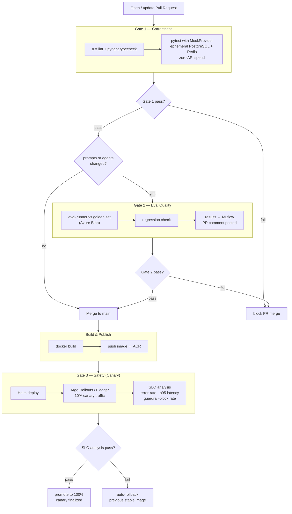

# Three-Gate CI/CD Pipeline

Bitbucket Pipelines flow: PR correctness gate, conditional eval quality gate, build/push to ACR, and canary deployment gate via Argo Rollouts with automatic SLO-based promotion or rollback.

