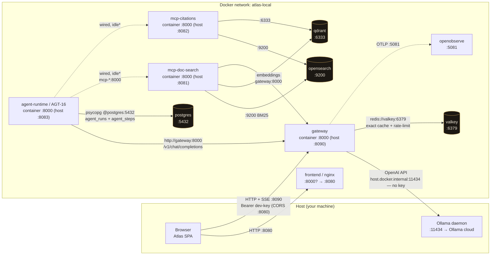

# Local stack — service communication (dev / docker-compose)

How the Atlas services talk in the `make local-up` offline loop
(`atlas-infra/local/compose.dev.yaml`). Three channels:

- **Container ↔ container** — Docker Compose DNS by *service name* on the shared
  `atlas-local` network, hitting the **container** port (gateway, agent-runtime,
  and both MCP servers all listen on `:8000` internally).
- **Browser → services** — the SPA is JS in the host browser, so it uses the
  **host-published** ports (`localhost:8090`, `:8080`).
- **Container → host** — the gateway reaches the host's Ollama via
  `host.docker.internal:11434`.

`-.->` = telemetry or wired-but-idle. \*The agent-runtime has the MCP URLs in its
env, but the AGT-16 loop does not execute tools yet (tool execution is outside
the runner), so those edges are configured for parity and currently idle.

## Host port map (host → container)

| Service | Host | Container | Notes |
|---|---|---|---|
| frontend | 8080 | 8080 | nginx SPA + `/config.json` |
| gateway | 8090 | 8000 | `:8000` collides with a local mcp-proxy |
| agent-runtime | 8083 | 8000 | AGT-16 trigger surface |
| mcp-doc-search | 8081 | 8000 | FastMCP `/mcp` |
| mcp-citations | 8082 | 8000 | FastMCP `/mcp` |
| qdrant | 6333 | 6333 | |
| opensearch | 9200 | 9200 | |
| postgres | 5432 | 5432 | |
| valkey | 6379 | 6379 | |
| mlflow | 5500 | 5000 | `:5000` collides with macOS AirPlay |
| openobserve | 5080/5081 | 5080/5081 | 5081 = OTLP sink |

## Invariants

- **The gateway is the single LLM egress.** Browser chat *and* agent-runtime go
  through the gateway to reach Ollama — nothing else calls Ollama directly. Auth,
  caching, rate-limiting, and accounting all live there.
- **The browser uses host ports** (`localhost:8090`), not service DNS, because it
  runs outside the network. In-cluster callers use `http://gateway:8000`.
- **No secrets on the wire** beyond the local `dev-key` placeholder; Ollama needs
  no key.
- `lowkey-vault` is gated behind the `parity` profile (not started);
  `azurite` / `mlflow` / `redpanda` are up for parity but no running service
  depends on them outside the `jobs` profile.
