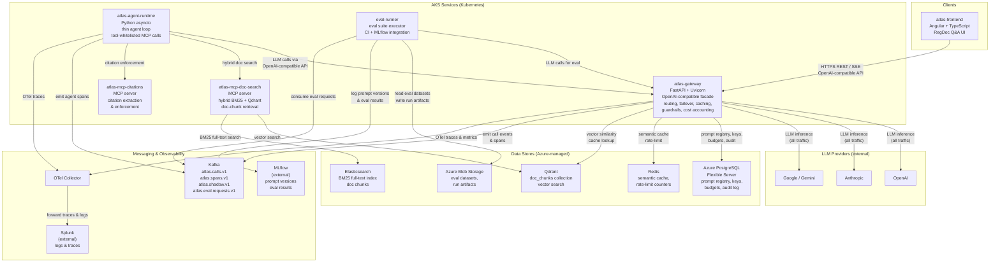

# Container Diagram — Atlas Platform (C4 Level 2)

All containers running inside AKS, the data stores, messaging/observability layer, and external LLM providers.

```mermaid
flowchart TB
    subgraph Clients["Clients"]
        Frontend["atlas-frontend\nAngular + TypeScript\nRegDoc Q&A UI"]
    end

    subgraph AKS["AKS Services (Kubernetes)"]
        Gateway["atlas-gateway\nFastAPI + Uvicorn\nOpenAI-compatible facade\nrouting, failover, caching,\nguardrails, cost accounting"]
        AgentRuntime["atlas-agent-runtime\nPython asyncio\nthin agent loop\ntool-whitelisted MCP calls"]
        MCPDocSearch["atlas-mcp-doc-search\nMCP server\nhybrid BM25 + Qdrant\ndoc-chunk retrieval"]
        MCPCitations["atlas-mcp-citations\nMCP server\ncitation extraction\n& enforcement"]
        EvalRunner["eval-runner\neval suite executor\nCI + MLflow integration"]
    end

    subgraph Data["Data Stores (Azure-managed)"]
        PG["Azure PostgreSQL\nFlexible Server\nprompt registry, keys,\nbudgets, audit log"]
        Redis["Redis\nsemantic cache,\nrate-limit counters"]
        Qdrant["Qdrant\ndoc_chunks collection\nvector search"]
        ES["Elasticsearch\nBM25 full-text index\ndoc chunks"]
        Blob["Azure Blob Storage\neval datasets,\nrun artifacts"]
    end

    subgraph MsgObs["Messaging & Observability"]
        Kafka["Kafka\natlas.calls.v1\natlas.spans.v1\natlas.shadow.v1\natlas.eval.requests.v1"]
        OTel["OTel Collector"]
        Splunk["Splunk\n(external)\nlogs & traces"]
        MLflow["MLflow\n(external)\nprompt versions\neval results"]
    end

    subgraph Providers["LLM Providers (external)"]
        OpenAI["OpenAI"]
        Anthropic["Anthropic"]
        Google["Google / Gemini"]
    end

    Frontend -->|"HTTPS REST / SSE\nOpenAI-compatible API"| Gateway

    Gateway -->|"LLM inference\n(all traffic)"| OpenAI
    Gateway -->|"LLM inference\n(all traffic)"| Anthropic
    Gateway -->|"LLM inference\n(all traffic)"| Google

    Gateway -->|"prompt registry, keys,\nbudgets, audit"| PG
    Gateway -->|"semantic cache\nrate-limit"| Redis
    Gateway -->|"vector similarity\ncache lookup"| Qdrant
    Gateway -->|"emit call events\n& spans"| Kafka
    Gateway -->|"OTel traces & metrics"| OTel

    AgentRuntime -->|"LLM calls via\nOpenAI-compatible API"| Gateway
    AgentRuntime -->|"hybrid doc search"| MCPDocSearch
    AgentRuntime -->|"citation enforcement"| MCPCitations
    AgentRuntime -->|"emit agent spans"| Kafka
    AgentRuntime -->|"OTel traces"| OTel

    MCPDocSearch -->|"vector search"| Qdrant
    MCPDocSearch -->|"BM25 full-text search"| ES

    EvalRunner -->|"LLM calls for eval"| Gateway
    EvalRunner -->|"read eval datasets\nwrite run artifacts"| Blob
    EvalRunner -->|"log prompt versions\n& eval results"| MLflow
    EvalRunner -->|"consume eval requests"| Kafka

    OTel -->|"forward traces & logs"| Splunk
```
