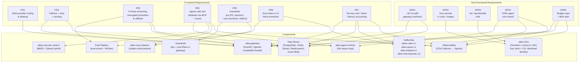

# Requirements Traceability — FR & NFR to Components

Each functional and non-functional requirement mapped to the Atlas components that satisfy it.

```mermaid
flowchart TB
    subgraph FunctionalReqs["Functional Requirements"]
        FR1["FR1\nMulti-provider routing\n& aliasing"]
        FR2["FR2\nFailover + retry\n+ caching"]
        FR3["FR3\nPrompt versioning,\neval-gated promotion\n& rollback"]
        FR4["FR4\nAgents with tool\nwhitelists via MCP\n+ traces"]
        FR5["FR5\nGuardrails\npre (PII, injection)\n+ post (schema, citation)"]
        FR6["FR6\nEval suites in CI\nblock promotion"]
        FR7["FR7\nPer-key cost / token\n/ latency accounting"]
    end

    subgraph NFRs["Non-Functional Requirements"]
        NFR1["NFR1\n<50 ms p95\ngateway overhead"]
        NFR2["NFR2\nZero secrets\nin code / images"]
        NFR3["NFR3\nIaC reproducible\ninfra"]
        NFR4["NFR4\n100% agent\nruns traced"]
        NFR5["NFR5\nBudget caps\n+ 80% alert"]
    end

    subgraph Components["Components"]
        Gateway["atlas-gateway\n(FastAPI, OpenAI-compatible facade)"]
        AgentRuntime["atlas-agent-runtime\n(thin async loop)"]
        MCPDocSearch["atlas-mcp-doc-search\n(BM25 + Qdrant hybrid)"]
        MCPCitations["atlas-mcp-citations\n(citation enforcement)"]
        Guardrails["Guardrails\n(pre + post filters in gateway)"]
        EvalPipeline["Eval Pipeline\n(eval-runner + MLflow)"]
        Observability["Observability\n(OTel Collector → Splunk)"]
        Infra["atlas-infra\n(Terraform / azurerm, AKS,\nKey Vault + CSI, Workload Identity)"]
        DataStores["Data Stores\n(PostgreSQL, Redis,\nQdrant, Elasticsearch,\nAzure Blob)"]
        Kafka["Kafka Bus\n(atlas.calls.v1,\natlas.spans.v1,\natlas.shadow.v1,\natlas.eval.requests.v1)"]
    end

    FR1 --> Gateway
    FR2 --> Gateway
    FR2 --> DataStores

    FR3 --> EvalPipeline
    FR3 --> Gateway
    FR3 --> DataStores

    FR4 --> AgentRuntime
    FR4 --> MCPDocSearch
    FR4 --> MCPCitations
    FR4 --> Observability

    FR5 --> Guardrails
    FR5 --> MCPCitations

    FR6 --> EvalPipeline
    FR6 --> Kafka

    FR7 --> Gateway
    FR7 --> DataStores
    FR7 --> Kafka
    FR7 --> Observability

    NFR1 --> Gateway
    NFR1 --> DataStores

    NFR2 --> Infra

    NFR3 --> Infra

    NFR4 --> AgentRuntime
    NFR4 --> Observability
    NFR4 --> Kafka

    NFR5 --> Gateway
    NFR5 --> DataStores
    NFR5 --> Observability
```
