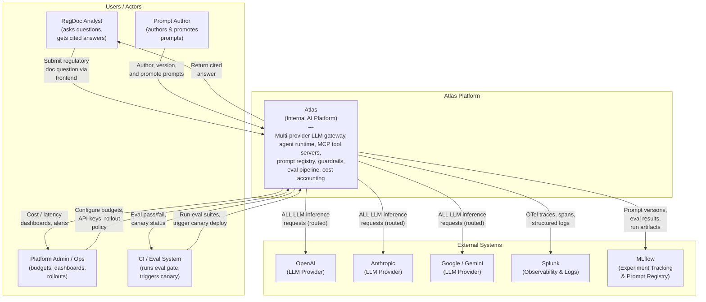

# System Context — Atlas Platform (C4 Level 1)

Atlas AI platform sits between four human actor groups and the external LLM providers and observability backends that power it.

```mermaid
flowchart TB
    subgraph Users["Users / Actors"]
        RegDocAnalyst["RegDoc Analyst\n(asks questions,\ngets cited answers)"]
        PromptAuthor["Prompt Author\n(authors & promotes\nprompts)"]
        PlatformAdmin["Platform Admin / Ops\n(budgets, dashboards,\nrollouts)"]
        CIEval["CI / Eval System\n(runs eval gate,\ntriggers canary)"]
    end

    subgraph AtlasPlatform["Atlas Platform"]
        Atlas["Atlas\n(Internal AI Platform)\n---\nMulti-provider LLM gateway,\nagent runtime, MCP tool servers,\nprompt registry, guardrails,\neval pipeline, cost accounting"]
    end

    subgraph External["External Systems"]
        OpenAI["OpenAI\n(LLM Provider)"]
        Anthropic["Anthropic\n(LLM Provider)"]
        Google["Google / Gemini\n(LLM Provider)"]
        Splunk["Splunk\n(Observability & Logs)"]
        MLflow["MLflow\n(Experiment Tracking\n& Prompt Registry)"]
    end

    RegDocAnalyst -->|"Submit regulatory\ndoc question via\nfrontend"| Atlas
    Atlas -->|"Return cited\nanswer"| RegDocAnalyst

    PromptAuthor -->|"Author, version,\nand promote prompts"| Atlas

    PlatformAdmin -->|"Configure budgets,\nAPI keys, rollout\npolicy"| Atlas
    Atlas -->|"Cost / latency\ndashboards, alerts"| PlatformAdmin

    CIEval -->|"Run eval suites,\ntrigger canary deploy"| Atlas
    Atlas -->|"Eval pass/fail,\ncanary status"| CIEval

    Atlas -->|"ALL LLM inference\nrequests (routed)"| OpenAI
    Atlas -->|"ALL LLM inference\nrequests (routed)"| Anthropic
    Atlas -->|"ALL LLM inference\nrequests (routed)"| Google

    Atlas -->|"OTel traces, spans,\nstructured logs"| Splunk
    Atlas -->|"Prompt versions,\neval results,\nrun artifacts"| MLflow
```
