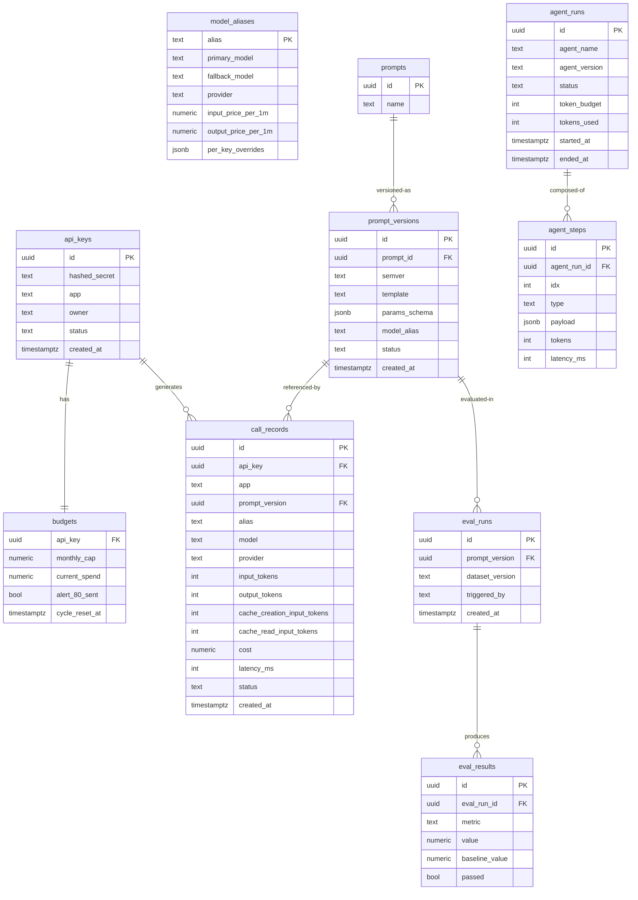

# Atlas Postgres ERD

All 10 Alembic-managed tables on Azure Database for PostgreSQL Flexible Server, with PKs, FKs, key columns, and ENUMs.

```mermaid
erDiagram
    api_keys {
        uuid id PK
        text hashed_secret
        text app
        text owner
        text status
        timestamptz created_at
    }

    budgets {
        uuid api_key FK
        numeric monthly_cap
        numeric current_spend
        bool alert_80_sent
        timestamptz cycle_reset_at
    }

    call_records {
        uuid id PK
        uuid api_key FK
        text app
        uuid prompt_version FK
        text alias
        text model
        text provider
        int input_tokens
        int output_tokens
        int cache_creation_input_tokens
        int cache_read_input_tokens
        numeric cost
        int latency_ms
        text status
        timestamptz created_at
    }

    model_aliases {
        text alias PK
        text primary_model
        text fallback_model
        text provider
        numeric input_price_per_1m
        numeric output_price_per_1m
        jsonb per_key_overrides
    }

    prompts {
        uuid id PK
        text name
    }

    prompt_versions {
        uuid id PK
        uuid prompt_id FK
        text semver
        text template
        jsonb params_schema
        text model_alias
        text status
        timestamptz created_at
    }
    %% status ENUM: draft | candidate | production | retired

    eval_runs {
        uuid id PK
        uuid prompt_version FK
        text dataset_version
        text triggered_by
        timestamptz created_at
    }

    eval_results {
        uuid id PK
        uuid eval_run_id FK
        text metric
        numeric value
        numeric baseline_value
        bool passed
    }

    agent_runs {
        uuid id PK
        text agent_name
        text agent_version
        text status
        int token_budget
        int tokens_used
        timestamptz started_at
        timestamptz ended_at
    }

    agent_steps {
        uuid id PK
        uuid agent_run_id FK
        int idx
        text type
        jsonb payload
        int tokens
        int latency_ms
    }
    %% type ENUM: llm_call | tool_call

    api_keys ||--|| budgets : "has"
    api_keys ||--o{ call_records : "generates"
    prompts ||--o{ prompt_versions : "versioned-as"
    prompt_versions ||--o{ call_records : "referenced-by"
    prompt_versions ||--o{ eval_runs : "evaluated-in"
    eval_runs ||--o{ eval_results : "produces"
    agent_runs ||--o{ agent_steps : "composed-of"
```
