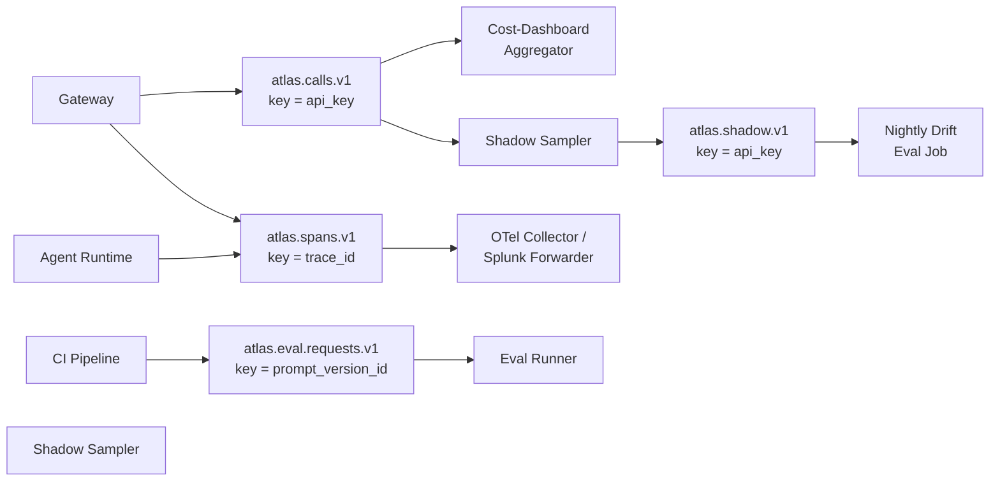

# Atlas Kafka Topics

Producer → topic → consumer flow for all four Atlas Kafka topics (Confluent-managed).



```json
{
  "atlas.calls.v1": {
    "partition_key": "api_key",
    "retention": "7 days",
    "sample_event": {
      "api_key": "ak_abc123",
      "alias": "gpt4o-prod",
      "model": "gpt-4o-2024-05-13",
      "provider": "openai",
      "app": "search-api",
      "input_tokens": 512,
      "output_tokens": 128,
      "cache_creation_input_tokens": 0,
      "cache_read_input_tokens": 256,
      "cost": 0.00192,
      "latency_ms": 843,
      "status": "success",
      "prompt_version_id": "pv_9f3c1a",
      "call_record_id": "cr_ffe120",
      "ts": "2026-06-06T12:00:00Z"
    }
  },
  "atlas.spans.v1": {
    "partition_key": "trace_id",
    "retention": "3 days",
    "sample_event": {
      "trace_id": "4bf92f3577b34da6a3ce929d0e0e4736",
      "span_id": "00f067aa0ba902b7",
      "parent_span_id": null,
      "service": "gateway",
      "operation": "llm_call",
      "start_time_unix_nano": 1749211200000000000,
      "end_time_unix_nano":   1749211200843000000,
      "attributes": {
        "api_key": "ak_abc123",
        "model": "gpt-4o-2024-05-13",
        "status": "success"
      }
    }
  },
  "atlas.shadow.v1": {
    "partition_key": "api_key",
    "retention": "14 days",
    "note": "Sampled subset of atlas.calls.v1 live traffic for nightly drift evaluation",
    "sample_event": {
      "source_call_record_id": "cr_ffe120",
      "api_key": "ak_abc123",
      "alias": "gpt4o-prod",
      "prompt_version_id": "pv_9f3c1a",
      "prompt_rendered": "Summarize the following: ...",
      "response": "The article covers ...",
      "sampled_at": "2026-06-06T12:00:01Z"
    }
  },
  "atlas.eval.requests.v1": {
    "partition_key": "prompt_version_id",
    "retention": "7 days",
    "sample_event": {
      "eval_run_id": "er_8a21b4",
      "prompt_version_id": "pv_9f3c1a",
      "dataset_version": "ds_v3",
      "triggered_by": "ci/github-actions",
      "requested_at": "2026-06-06T08:00:00Z"
    }
  }
}
```
