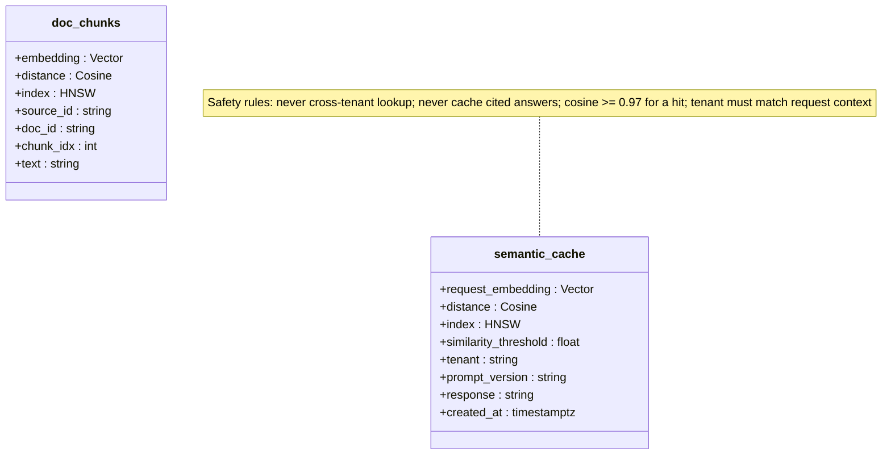

# Atlas Qdrant Collections

Two Qdrant collections used for document retrieval and semantic caching, with vector config, index, payload schema, and safety constraints.

```mermaid
classDiagram
    class doc_chunks {
        +embedding : Vector
        +distance : Cosine
        +index : HNSW
        +source_id : string
        +doc_id : string
        +chunk_idx : int
        +text : string
    }

    class semantic_cache {
        +request_embedding : Vector
        +distance : Cosine
        +index : HNSW
        +similarity_threshold : float
        +tenant : string
        +prompt_version : string
        +response : string
        +created_at : timestamptz
    }

    note for semantic_cache "Safety rules: never cross-tenant lookup; never cache cited answers; cosine >= 0.97 for a hit; tenant must match request context"
```
