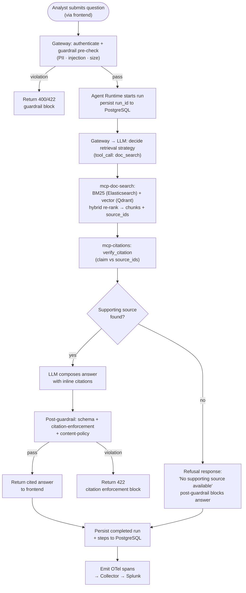

# Analyst: Ask a Question, Receive a Citation-Enforced Answer

User-flow activity diagram showing the path from an analyst's question through agent retrieval and citation verification to a grounded answer, including the refusal branch when no supporting source exists.

