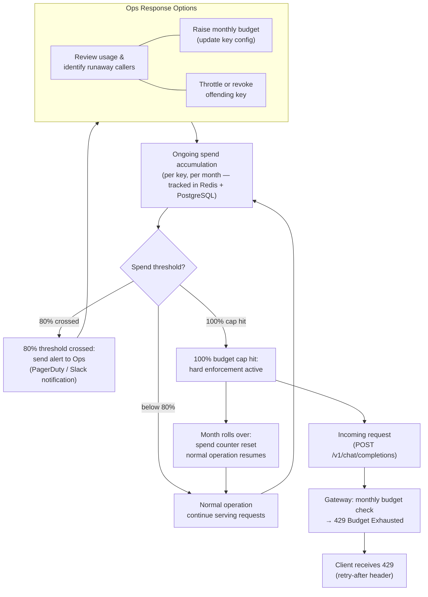

# Budget Alert & Cap Enforcement Flow

Activity flow showing the monthly budget monitoring path: 80% spend threshold triggers an alert for Ops action; 100% cap hit enforces a 429 response for all subsequent requests.

