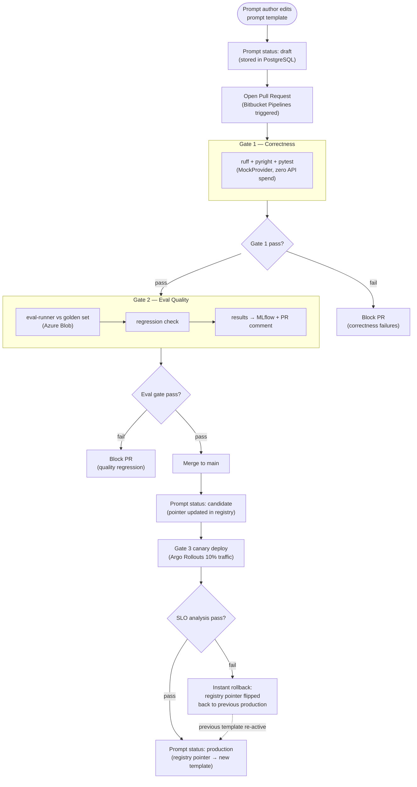

# Prompt Promotion Lifecycle

Activity flow showing how a prompt author edits a template, opens a PR, passes the eval gate to advance from draft to candidate to production, and the instant-rollback path via pointer flip.

