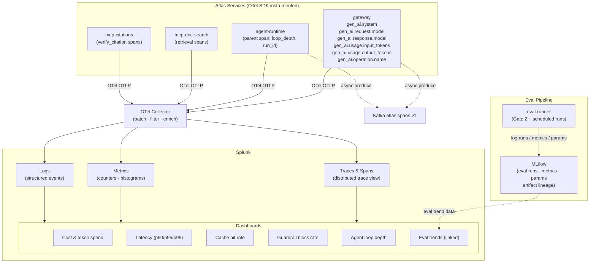

# Observability: OTel → Splunk + MLflow

Data flow for runtime observability (traces, metrics, logs via OpenTelemetry to Splunk) and evaluation observability (eval-runner results to MLflow), converging in operational dashboards.

