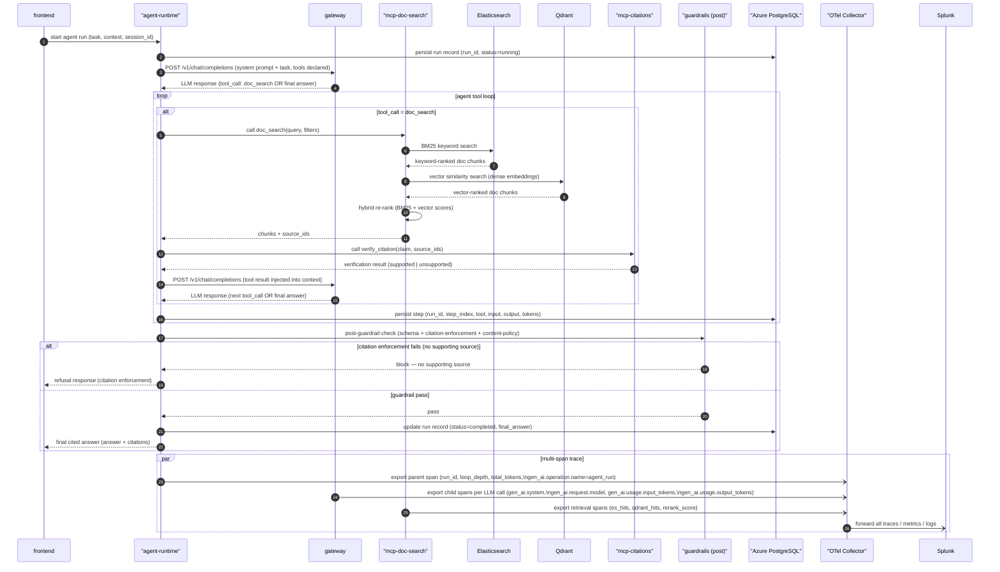

# Agent RAG Run End-to-End Sequence

System-level flow for an agent run with retrieval-augmented generation: Frontend through Agent Runtime tool loop, document search, citation verification, guardrails, and distributed tracing.

