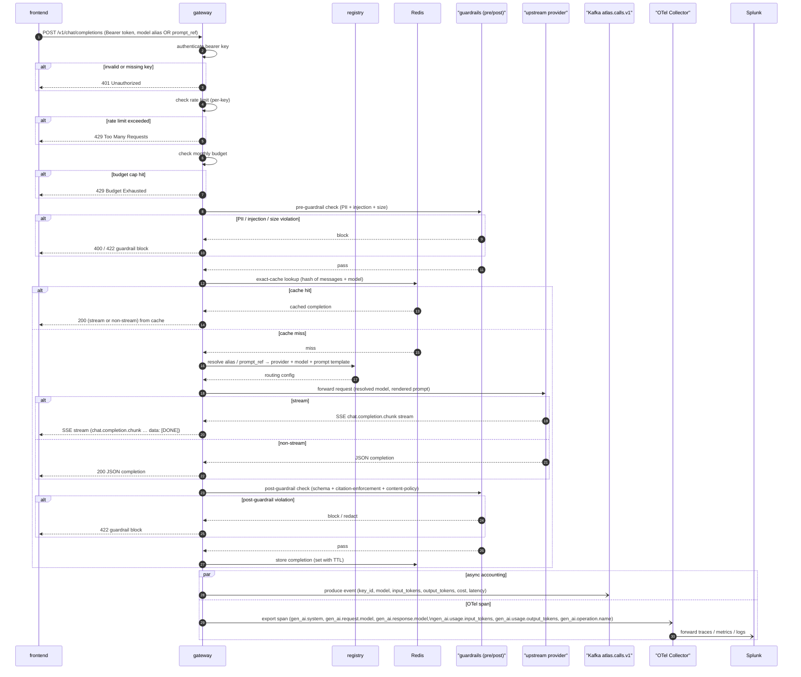

# Chat Request End-to-End Sequence

System-level flow for a single chat completion: Frontend through Gateway guardrails, cache, provider routing, and async accounting/observability side-channels.

```mermaid
sequenceDiagram
    autonumber
    participant FE as frontend
    participant GW as gateway
    participant REG as registry
    participant CACHE as Redis
    participant GUARD as "guardrails (pre/post)"
    participant PROV as "upstream provider"
    participant KAFKA as "Kafka atlas.calls.v1"
    participant OTEL as "OTel Collector"
    participant SPLUNK as Splunk

    FE->>GW: POST /v1/chat/completions (Bearer token, model alias OR prompt_ref)
    GW->>GW: authenticate bearer key
    alt invalid or missing key
        GW-->>FE: 401 Unauthorized
    end
    GW->>GW: check rate limit (per-key)
    alt rate limit exceeded
        GW-->>FE: 429 Too Many Requests
    end
    GW->>GW: check monthly budget
    alt budget cap hit
        GW-->>FE: 429 Budget Exhausted
    end

    GW->>GUARD: pre-guardrail check (PII + injection + size)
    alt PII / injection / size violation
        GUARD-->>GW: block
        GW-->>FE: 400 / 422 guardrail block
    end
    GUARD-->>GW: pass

    GW->>CACHE: exact-cache lookup (hash of messages + model)
    alt cache hit
        CACHE-->>GW: cached completion
        GW-->>FE: 200 (stream or non-stream) from cache
    else cache miss
        CACHE-->>GW: miss

        GW->>REG: resolve alias / prompt_ref → provider + model + prompt template
        REG-->>GW: routing config

        GW->>PROV: forward request (resolved model, rendered prompt)
        alt stream
            PROV-->>GW: SSE chat.completion.chunk stream
            GW-->>FE: SSE stream (chat.completion.chunk … data: [DONE])
        else non-stream
            PROV-->>GW: JSON completion
            GW-->>FE: 200 JSON completion
        end

        GW->>GUARD: post-guardrail check (schema + citation-enforcement + content-policy)
        alt post-guardrail violation
            GUARD-->>GW: block / redact
            GW-->>FE: 422 guardrail block
        end
        GUARD-->>GW: pass

        GW->>CACHE: store completion (set with TTL)
    end

    par async accounting
        GW-)KAFKA: produce event (key_id, model, input_tokens, output_tokens, cost, latency)
    and OTel span
        GW-)OTEL: export span (gen_ai.system, gen_ai.request.model, gen_ai.response.model,\ngen_ai.usage.input_tokens, gen_ai.usage.output_tokens, gen_ai.operation.name)
        OTEL-)SPLUNK: forward traces / metrics / logs
    end
```
